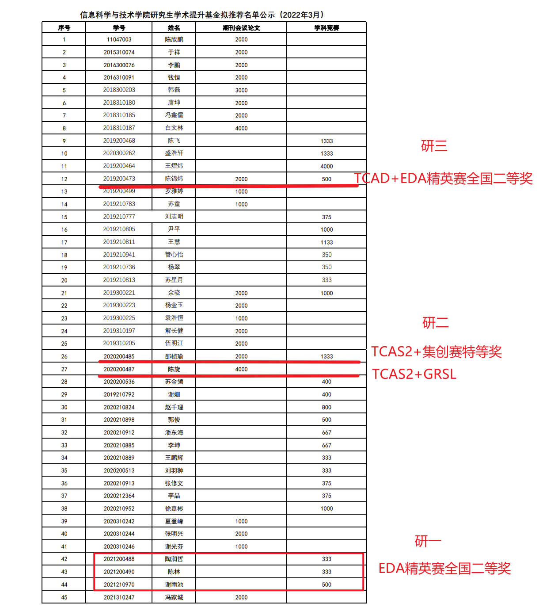
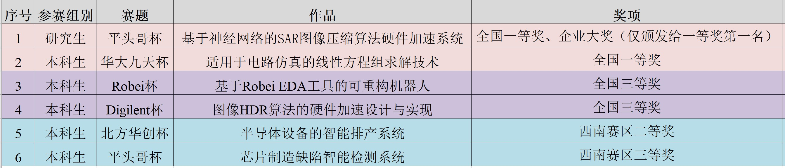
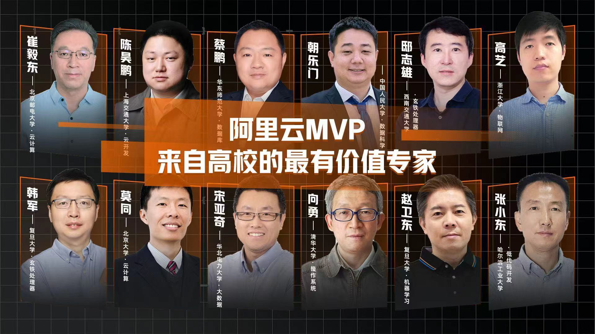

- 2023.08，祝贺实验室三位本科生荣获全国大学生集成电路创新创业大赛飞腾处理器赛道全国二等奖！同学们针对飞腾CPU架构的特点，提出了一种基于帧间预测和照度生成的高速LIME算法，协同使用NEON、OpenMP等将LIME算法在飞腾CPU上的运行效率加速218倍；针对飞腾CPU架构，构建了JPEG、SM4、TinyMaix等常用加速函数库，为飞腾CPU的生态建设贡献了一点点工作！ 
- 2023.08，祝贺实验室研究生队伍（陶润哲、谢雨池、陈林）荣获第六届“华为杯”中国研究生创“芯”大赛全国一等奖！[西南交大研究生院报道](https://gsnews.swjtu.edu.cn/info/1068/6803.htm) 
- 2023.07，祝贺实验室两组本科生队伍分别荣获第七届全国大学生集成电路创新创业大赛西南赛区一等奖、二等奖！
- 2023.05, 祝贺实验室硕士生陈旋（论文：-面向SAR图像压缩芯片的软件模型及硬件物理设计优化研究）、邵桢瑜（论文：基于软硬件协同搜索的SAR图像压缩加速器自动化设计方法）、陈卓（论文：基于缓存优化的ZynqNet硬件加速器设计）顺利通过答辩。 
- 2023.05, 祝贺实验室本科生范峻凌（论文：基于学习方法的时序预测模型设计）、梁国琦（论文：多实例化分块布图下的顶层布线算法研究）、王雄（论文：基于FPGA的手写数字识别系统设计）、颜飞扬（论文：FPGA加速器高效敏捷生成器设计）、黄亦成（论文：国密SM2算法核心点乘硬件加速器IP设计）、超松（论文：基于生成器的可重构阵列电路设计）顺利通过答辩。 
- 2023.05, 祝贺实验室本科生徐启涵同学（现中科院读研）学术论文IEEE GRSL’2022入选第十五届全国大学生创新创业年会学术论文展。 
- 2023.04, 祝贺邸志雄老师主讲的MOOC课程《硬件加速设计方法》入选“成渝地区双城经济圈普通本科高校智慧教育优秀案例”。  
- 2023.03, 祝贺实验室硕士生陈旋，入选 SWJTU研·人物 | 【竢实扬华奖章】陈旋：始于初“芯”，忠于初心。[西南交大学生处官网公众号报道](https://mp.weixin.qq.com/s/R1QKYuWrer3ZD-Wu8YRUdg) 
- 2023.03, 祝贺实验室硕士生陈旋、邵桢瑜、本科生颜飞扬入选四川省优秀毕业生；实验室本科生黄亦成、超松入选校级优秀毕业生。 
- 2022.12, 祝贺实验室硕士生陈旋同学荣获学校授予学生的最高荣誉“竢实扬华”奖章，本年度全校仅授予4名硕士研究生。
- 2022.12, 祝贺实验室两支队伍在“第四届集成电路EDA设计精英挑战赛”中荣获全国一等奖1项（入围TOP 9路演），全国二等奖1项。时隔两年，实验室的参赛队伍再次进入路演，角逐大奖。（1）陶润哲、陈林、范峻凌（本科），荣获行芯赛题“感知物理信息的智能化时序估算模型”第一名，作品构建了SPEF读取的多线程映射与加速方法，设计了丰富而准确的特征库，提出了一种高准确率的延迟预测模型；（2）谢雨池、向瀚章、卢锦程（本科），荣获新思赛题“多实例化分块布图下的顶层布线”全国二等奖，针对赛题的需求对现有GR、DR、mazerouting等框架进行了优化和适配。[西南交大官网报道](https://news.swjtu.edu.cn/info/1013/36394.htm)
- 2022.12, 祝贺实验室一支研究生队伍、一支本科生队伍获“全国大学生嵌入式芯片与系统设计竞赛——FPGA 创新设计竞赛” （国家级A类竞赛）全国二等奖1项，全国三等奖1项；其中，全国二等奖作品因系统复杂、工程能力强，荣获大赛颁发的“最佳工程奖”。
- 2022.11，祝贺邸志雄老师入选2022年度教育部——华为“智能基座”优秀教师奖励计划！（本年度全国仅20人入选）[官方报道](https://mp.weixin.qq.com/s/pG-FEUk5a73Hjn5xi-jGow)
- 2022.12, 祝贺实验室一支研究生队伍、一支本科生队伍获“全国大学生嵌入式芯片与系统设计竞赛——FPGA 创新设计竞赛” （国家级A类竞赛）全国二等奖1项，全国三等奖1项；其中，全国二等奖作品因系统复杂、工程能力强，荣获大赛颁发的“最佳工程奖”。
- 2022.12, 祝贺实验室硕士生陈旋同学荣获学校授予学生的最高荣誉“竢实扬华”奖章，本年度全校仅授予4名硕士研究生。
- 2022.12, 祝贺实验室两支队伍在“第四届集成电路EDA设计精英挑战赛”中荣获全国一等奖1项（入围TOP 9路演），全国二等奖1项。时隔两年，实验室的参赛队伍再次进入路演，角逐大奖。（1）陶润哲、陈林、范峻凌（本科），荣获行芯赛题“感知物理信息的智能化时序估算模型”第一名，作品构建了SPEF读取的多线程映射与加速方法，设计了丰富而准确的特征库，提出了一种高准确率的延迟预测模型；（2）谢雨池、向瀚章、卢锦程（本科），荣获新思赛题“多实例化分块布图下的顶层布线”全国二等奖，针对赛题的需求对现有GR、DR、mazerouting等框架进行了优化和适配。[西南交大官网报道](https://news.swjtu.edu.cn/info/1013/36394.htm)
- 2022.12, 祝贺实验室一支研究生队伍、一支本科生队伍获“全国大学生嵌入式芯片与系统设计竞赛——FPGA 创新设计竞赛” （国家级A类竞赛）全国二等奖1项，全国三等奖1项；其中，全国二等奖作品因系统复杂、工程能力强，荣获大赛颁发的“最佳工程奖”。
- 2022.11，祝贺邸志雄老师入选2022年度教育部——华为“智能基座”优秀教师奖励计划！（本年度全国仅20人入选）[官方报道](https://mp.weixin.qq.com/s/pG-FEUk5a73Hjn5xi-jGow)
- 2022.12, 祝贺实验室一支研究生队伍、一支本科生队伍获“全国大学生嵌入式芯片与系统设计竞赛——FPGA 创新设计竞赛” （国家级A类竞赛）全国二等奖1项，全国三等奖1项；其中，全国二等奖作品因系统复杂、工程能力强，荣获大赛颁发的“最佳工程奖”。
- 2022.09，祝贺陈卓、陈旋、邵桢瑜三位同学设计的“高分辨星地协同计算硬件系统”荣获中国研究生电子设计大赛全国一等奖。[西南交大官网报道](https://news.swjtu.edu.cn/shownews-24899.shtml)
- 2022.09，祝贺两组同学（付文慧、杨弘毅、罗宇辰；颜飞扬、李鸿建、杨欣睿）荣获2022年全国大学生集成电路创新创业大赛“飞腾杯”全国二等奖。集创赛A组赛道不区分学历，本科生和研究生在完全一致的技术指标要求下同场竞技。在此次集创赛中，两支由本科生组成的参赛队伍在A组赛道与来自全国的研究生队伍PK脱颖而出，最终荣获全国二等奖，实属不易。 
- 2022.07，祝贺陈卓、陈旋、邵桢瑜三位同学设计的“高分辨星地协同计算硬件系统”荣获中国研究生电子设计大赛西南赛区一等奖，并晋级全国总决赛。同时，荣获Xilinx企业杯、飞腾杯全国优秀奖。  
- 2022.07，祝贺MOOC《芯动力-硬件加速设计方法》入选**四川省第三批线上一流课程**。
- 2022.07，祝贺同学们在第六届全国大学生集成电路创新创业大赛西南赛区荣获3项一等奖、1项二等奖、1项三等奖。  
 
- 2022.06，祝贺硕士生陈锦炜同学顺利毕业，毕业论文题目“数字集成电路布局合法化与布线层分配算法研究”。陈锦炜同学即将加入国产FPGA领军企业上海安路科技，担任FPGA物理实现算法研发工程师。硕士期间，第一作者发表**IEEE TCAD（EDA领域顶刊）论文1篇**、ICSICT（EI检索会议）论文1篇。
 
- 2022.06，祝贺9位本科生同学顺利毕业。
 
- 2022.05，祝贺主讲的《数字集成电路静态时序分析基础》课程在B站播放量破**十万**。
- 2022.03，祝贺主讲的MOOC《硬件加速设计方法》课程在国家高等教育智慧教育平台上线。国家高等教育智慧教育平台是由教育部委托、高等教育出版社建设的全国性、综合性在线开放课程平台，致力于汇聚优质高等教育在线课程资源，面向高校师生和社会学习者提供全面、优质、便利的在线学习服务。
- 2022.03，祝贺主讲的《数字集成电路静态时序分析基础》课程在B站播放量破五万。
- 2022.03，祝贺实验室6位同学荣获“信息科学与技术学院研究生提升基金”。

- 2022.03，祝贺实验室研二硕士生邵桢瑜被推荐为“2021中国电子学会集成电路奖学金候选人”。
- 2022.02，祝贺B站“讲芯片的邸老师”粉丝突破1万人。
- 2022.02，祝贺实验室研二陈旋同学的工作"Learned Compression Framework with Pyramidal Features and Quality Enhancement for SAR images"被IEEE GRSL录用。
- 2021.12，祝贺实验室两组研究生同学在“2021第三届集成电路EDA设计精英挑战赛”新思科技2.5D布局算法赛道、国微multi-patterning DRC检测算法赛道荣获两项全国二等奖！祝贺锦炜同学因以去年安路科技赛道第一名作品为基础投稿IEEE TCAD（EDA领域顶级期刊）被录用论文，荣获大赛首次颁发的“学术进取奖”。有幸因连续三届指导学生获奖，被授予“EDA精心育人奖”。有幸因担任安路赛题chair，被授予“专业贡献奖”。感谢EDA精英挑战赛组委会！
- 2021.12，祝贺实验室研三陈锦炜同学的工作"NBLG: A Robust Legalizer for Mixed-Cell-Height Modern Design"被IEEE TCAD录用。
- 2021.12，《基于玄铁CPU与无剑SoC的芯片设计与应用产教融合精品慕课建设》课程体系改革项目成功入选2021年度教育部产学合作协同育人优秀项目案例。
- 2021.09，10月31日，全国大学生嵌入式芯片与系统设计竞赛全国总决赛成功在线上举办。我校信息科学与技术学院参赛队伍作品“海洋生物声学分类SoC芯片设计”（指导教师邸志雄；队员范峻凌、黄亦成、廖才进）在总决赛中发挥出色，荣获“芯片设计赛道”本科生组全国唯一的一等奖，并获“芯来科技杯”企业大奖。祝贺实验室本科生范峻凌、黄亦成同学！
- 2021.09，邸志雄老师荣获西南交通大学“立德树人”先进个人：“教书育人”新秀奖！
- 2021.08，第五届全国大学生集成电路创新创业大赛中，指导学生荣获 1 项特等奖、2 项一等奖、2 项三等奖！
  
- 2021.06，祝贺实验室两位本科生徐启涵、向云帆同学的工作“Synthetic Aperture Radar Image Compression Based on a Variational Autoencoder”被IEEE Geoscience Remote Sensing Letters录用！
- 2021.06，祝贺实验室两位毕业的同学：祝贺硕士生吴伟同学（SP Offer）加入华为海思，祝贺本科生刘已秋同学（SSP Offer）加入国产EDA公司奥卡思微电子！
- 2021.06，祝贺指导的本科生顺利通过答辩！  
  
- 2021.06，祝贺实验室研一陈旋、研三吴伟同学的工作“Detailed Routing Short Violation Prediction Using Graph-based Deep Learning Model”被TCAS2录用！文章提出了一种布局阶段基于GNN的routability预测模型，能够在小规模数据集上实现目前最强的泛化能力。
- 2021.06，邸志雄老师荣获2021年“阿里云MVP”！
  
- 2021.06，祝贺实验室研一邵桢瑜同学的工作"A High-Throughput VLSI Architecture Design Of Canonical Huffman Encoder"被IEEE TCAS2录用。
- 2021.04，教学论文“ASIC Design Principle Course with Combination of Online-MOOC and Offline-Inexpensive FPGA Board”被微电子与集成电路领域知名国际学术会议“2021 31th ACM Great Lakes Symposium on VLSI”(CCF-C)录用（Oral Report; Panel 嘉宾）。该论文系西南交大微电子学科首次在集成电路国际学术会议展示教学成果。该论文相关教学改革工作被“电子学报”官网首页头条报道（2021.5.30）、被中国电子电子学会官网、“电子学报”公众号、“中国电子学会”公众号报道。
  
- 2021.01.12，邸志雄老师荣获2020年“詹天佑铁道科学技术奖”之“教书育人”专项奖！
- 2020.12.06，祝贺研一陈卓同学的作品“基于Xilinx DPU的芯片表面缺陷检测硬件加速系统”荣获“2020第四届全国大学生FPGA创新设计竞赛”全国二等奖！  

- 2020.12.01，第二届EDA精英挑战赛圆满落幕，作为国内水平最高的EDA算法竞赛，本次竞赛得到了几乎国内所有EDA公司、国际三大EDA巨头、国产FPGA公司安路、华为海思的支持，硕博参赛比例接近80%！祝贺本实验室学生获得两项一等奖！1.研二学生陈锦炜带领两位大四师妹，荣获FPGA  CAD赛道(命题公司安路科技)第一名，团队提出一种新的FPGA布局合法化算法，在10个benchmark中9个排名第1、1个排名第二，以高出第二名接近15分(百分制)的巨大优势获得赛题冠军；锦炜同学继2019年后再获一项一等奖。2.大四学生刘已秋以一人之力，获得Verilog多驱动解析赛道(命题公司芯华章)一等奖，其中算法benchmark测试为仅有的两支满分队伍之一，笔试成绩第一。感谢大赛组委会！！ 

- 2020.11.03，祝贺实验室研一陈旋（论文接收时为大四）提出的“Detailed Routing Short Violations Prediction Method Using Graph Neural Network”和陈锦炜提出的“An Enhanced Heuristic Layer Assignment Method in Global Routing”在ICSICT2020做口头汇报！
- 2020.10.30，祝贺实验室本科生刘已秋同学加入国产知名EDA公司奥卡思微电子！
- 2020.10.13，祝贺实验室研一硕士生邵桢瑜同学“JPEG图像编解码FPGA系统”荣获中国研究生“创芯”大赛企业杯二等奖！
- 2020.09.01，祝贺实验室研二硕士生陈锦炜同学关于FPGA布线算法的作品荣获“复微杯电子设计竞赛”优秀奖！  
- 2020.08.23，祝贺与复旦大学ASIC重点实验室范益波教授合作的项目“基于硬件的JPEG无损编码及转码系统项目”荣获阿里巴巴创新研究计划优秀学术项目奖！  
- 2020.08.23，祝贺2017级本科生马晓宝同学、陈春晖同学、徐新权同学荣获2020年“第四届全国大学生集成电路创新创业大赛” 全国一等奖，并摘得大赛最高奖项“RISC-V挑战杯”（等同特等奖，仅颁发给一等奖第一名）！  
- 2020.07.21，祝贺实验室2017级本科生马晓宝同学与陈春晖同学荣获2020年“第四届全国大学生集成电路创新创业大赛”西南赛区一等奖，并入围全国总决赛！  
- 2020.07.17，祝贺实验室2016级本科生林思成同学入职国产FPGA顶尖公司“紫光同创”！

**返回教师主页**
---
[个人主页](http://www.dizhixiong.cn/)
