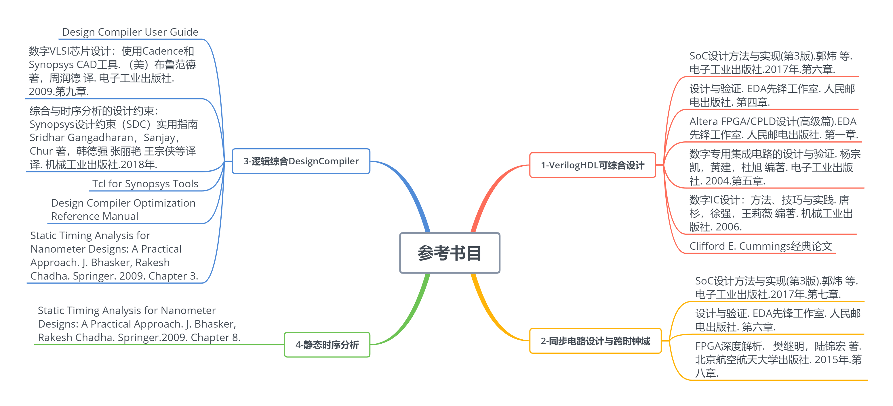

芯动力——硬件加速设计方法
===

[课程主页](https://www.icourse163.org/course/SWJTU-1207492806?tid=1207824209)。

课程概述
---
本课程的教学内容主要包括：

1.  VerilogHDL可综合设计。课程收获：如何避免常见的VerilogHDL代码误区，如何在考
    虑性能、面积、功耗、后端实现的情况下，编写高质量代码。

2.  同步电路设计与跨时钟域电路设计。课程收获：学会理解经典跨时钟域同步电路设计
    原理；理解和掌握异步FIFO"空""满"设计原理，掌握FIFO深度计算方法；理解"异步复
    位、同步释放"的原理和方法；理解 "一段式"、"两段式"、"三段式"状态机电路结构
    的异同，掌握状态机编写方法。

3.  逻辑综合DesignCompiler基本原理和方法。课程收获：掌握DesignCompiler使用流程，
    并理解DesignCompiler的约束；掌握Synopsys TCL语言的应用方法。

4.  静态时序分析。课程收获：理解建立时间与保持时间的计算原理，掌握多时钟下数据
    路径的建立时间和保持时间的检查方法。

5.  FPGA硬件加速案例等。"FPGA硬件加速案例"采用了2018年全国大学生集成电路创新创
    业一等奖作品"基于Xilinx PYNQ FPGA的Softmax函数硬件加速设计"，相关工程和代码
    已经在github开源。如果听众手里有PYNQ Z2开发板，则可以复现该作品。

课程大纲
---

01: 概述

学习目标：了解硬件加速的意义；知悉芯片设计领域的行业分工与特点；熟悉数字芯片设计的流程和EDA工具；

该章节课时标题：

1.1硬件加速意义

1.2芯片设计领域的行业分工与特点

1.3数字芯片设计的流程和EDA工具

02: VerilogHDL可综合设计

学习目标：知悉如何避免常见的VerilogHDL代码误区；掌握如何在考虑性能、面积、功耗、后端实现的情况下，编写高质量代码；掌握常见的RTL设计指导原则。

该章节课时标题：

2.1. 可综合风格

2.2. 在RTL编码中考虑时延、面积、功耗和后端

2.3. RTL设计指导原则

03: 同步电路设计与跨时钟域

学习目标：学会理解经典跨时钟域同步电路设计原理；理解和掌握异步FIFO"空""满"设计原理，掌握FIFO深度计算方法；理解"异步复位、同步释放"的原理和方法；理解
"一段式"、"两段式"、"三段式"状态机电路结构的异同，掌握状态机编写方法。

该章节课时标题：

3.1. 同步电路与异步电路

3.2. 跨时钟域同步器设计

3.3. FIFO

3.4. 异步复位、同步释放

3.5. 状态机

04: 逻辑综合DesignCompiler

学习目标：掌握DesignCompiler使用流程，并理解DesignCompiler的约束；掌握Synopsys
TCL语言的应用方法。

该章节课时标题：

4.1. 工艺库

4.2. 逻辑综合约束

4.3. Synopsys DC使用流程

4.4. Synopsys TCL语言简介

05: 静态时序分析

学习目标：理解建立时间与保持时间的计算原理，掌握多时钟下数据路径的建立时间和保持时间的检查方法。

该章节课时标题：

5.1. 建立时间检查

5.2. 保持时间检查

5.3. 慢时钟与快时钟切换的静态时序分析

5.4. 多时钟与半周期静态时序分析

06: FPAG硬件加速案例

学习目标：基于给出的"FPGA硬件加速案例"的开源代码，理解并复现该作品。相关工程和代码已经在github开源。

该章节课时标题：

6.1. FPGA硬件加速流程

6.2. PYNQ案例：2018年全国大学生集成电路创新创业一等奖作品

---
**课程图片**：

参考资料
---

第二章-VerilogHDL可综合设计

1.  SoC设计方法与实现(第3版).郭炜 等. 电子工业出版社.2017年.第六章.

2.  设计与验证. EDA先锋工作室. 人民邮电出版社. 第四章.

3.  Altera FPGA/CPLD设计(高级篇).EDA先锋工作室. 人民邮电出版社. 第一章.

4.  数字专用集成电路的设计与验证. 杨宗凯，黄建，杜旭 编著.
    电子工业出版社. 2004.第五章.

5.  数字IC设计：方法、技巧与实践. 唐杉，徐强，王莉薇 编著.
    机械工业出版社. 2006.

6.  Clifford E. Cummings经典论文

第三章-同步电路设计与跨时钟域

1.  SoC设计方法与实现(第3版).郭炜 等. 电子工业出版社.2017年.第七章.

2.  设计与验证. EDA先锋工作室. 人民邮电出版社. 第六章.

3.  FPGA深度解析. 樊继明，陆锦宏 著. 北京航空航天大学出版社.
    2015年.第八章.

第四章-逻辑综合DesignCompiler

1.  Design Compiler User Guide

2.  数字VLSI芯片设计：使用Cadence和Synopsys CAD工具. （美）布鲁范德
    著，周润德 译. 电子工业出版社. 2009.第九章.

3.  综合与时序分析的设计约束：Synopsys设计约束（SDC）实用指南

4.  Sridhar Gangadharan，Sanjay，Chur 著，韩德强 张丽艳 王宗侠等译 译.
    机械工业出版社.2018年.

5.  Tcl for Synopsys Tools

6.  Design Compiler Optimization Reference Manual

7.  Static Timing Analysis for Nanometer Designs: A Practical
    Approach. J. Bhasker, Rakesh Chadha. Springer. 2009. Chapter 3.

第五章-静态时序分析

1. Static Timing Analysis for Nanometer Designs: A Practical Approach. J.
Bhasker, Rakesh Chadha. Springer.2009. Chapter 8.

课程内容
---

参考网站
---
- [PYNQ: PYTHON PRODUCTIVITY](http://www.pynq.io/)
