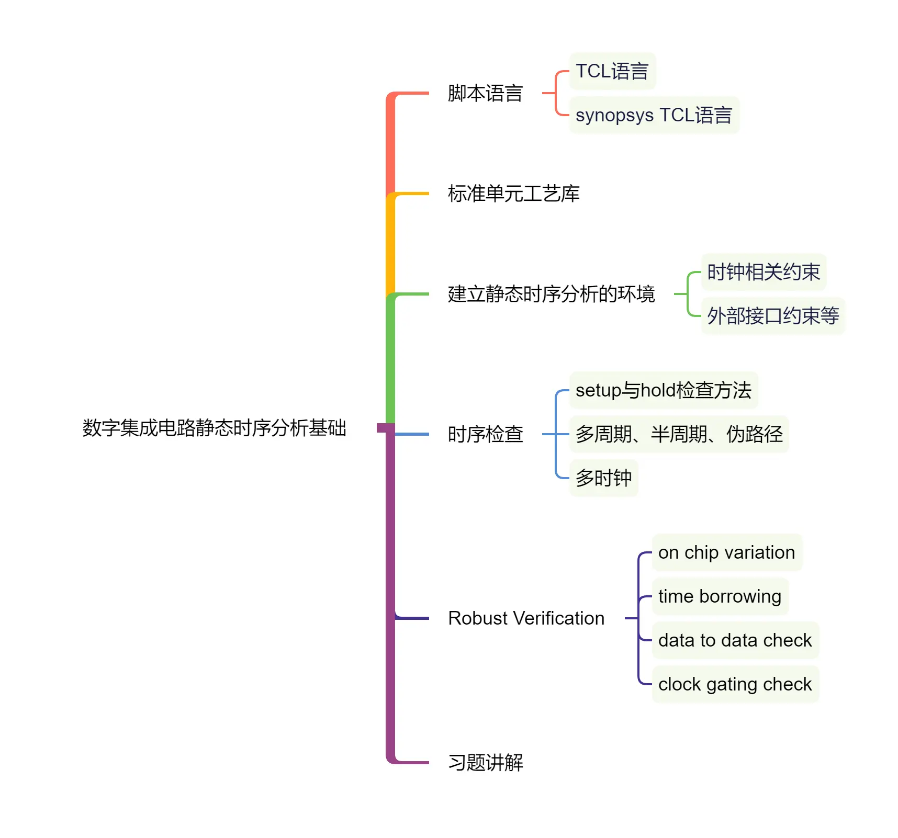

数字集成电路静态时序分析基础
===
[课程主页](https://www.iccollege.cn/portal/courseDetail/193.mooc)。

授课教师
---
邸志雄，博士，硕士研究生导师，西南交通大学信息学院电子工程系副系主任。CCF会员、
中国图象图形学学会军民融合专委会成员、新工科联盟“可定制计算”专委会成员。研究方
向为高性能图像编解码芯片技术研究、布局布线算法研究。近年来主持国家自然科学基金
青年项目、四川省科技厅项高新重点项目等项目，参与完成了我国自主研制的首颗宇航级
高速图像压缩芯片“雅芯-天图”。指导学生多次获得创芯大赛、全国大学生集成电路创新创
业大赛、集成电路设计EDA精英挑战赛、全国大学生FPGA创新设计竞赛、Xilinx OpenHW等国家级奖项。

课程概述
---
时序收敛是数字集成电路和FPGA都极为关注的指标，不管在前端RTL设计还是后端物理实现阶段都需要投入大量的时间和精力。本课程以经典书籍《Static Timing Analysis for Nanometer Designs: A Practical Approach》为教材，重点以Synopsys TCL语言入门、工艺库、复杂时序路径分析方法为核心内容，辅以时序分析笔试题，期望通过这门课程掌握静态时序分析方法。

课程大纲
---

- 脚本语言
  1. TCL语言
  2. synopsys TCL语言
- 标准单元工艺库
- 建立静态时序分析的环境
  1. 时钟相关约束
  2. 外部接口约束等
- 时序检查
  1. setup与hold检查方法
  2. 多周期、半周期、伪路径
  3. 多时钟
- Robust Verification
  1. on chip variation
  2. time borrowing
  3. data to data check
  4. clock gating check
- 习题讲解

前序知识
---具备数字集成电路、ASIC/SoC/FPGA设计等基础知识。

课程内容
---
<!-- ：按章节划分，每个章节的名称、链接、课件PDF文件。 -->

参考资料
---
1. Static Timing Analysis for Nanometer Designs: A Practical Approach. J.
   Bhasker, Rakesh Chadha. Springer Science Business Media, LLC 2009. 
2. 综合与时序分析的设计约束：Synopsys设计约束（SDC）实用指南。[美] 斯里达尔·甘
   加达兰（Sridhar Gangadharan），[印度] 桑杰·丘里瓦拉（Sanjay，Chur 著，韩德强
   张丽艳 王宗侠等译 译 
3. 集成电路静态时序分析与建模. 刘峰, 机械工业出版社.出版时间：2016-07-01.
