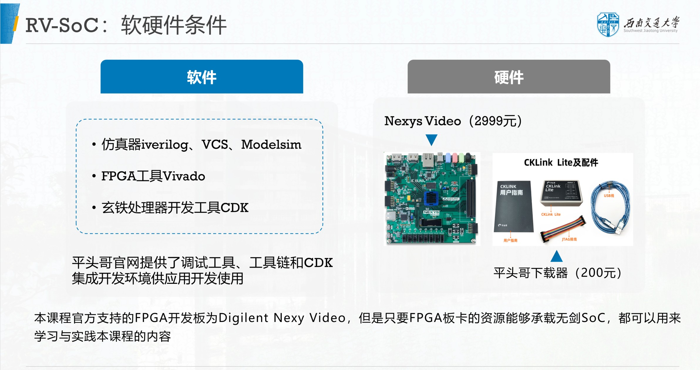

RV-SoC Design Methodology Based on T-Head E902
===

“无剑100”开源SoC采用平头哥半导体公司自主研发的玄铁处理器核E902，是一款具有极低功耗、极低成本的嵌入式CPU核，主要面向智能卡、智能电网、低成本微控制器、无线传感网络等嵌入式应用。本课程基于平头哥E902与“无剑100”，重点讲述无剑100 架构、SoC集成、RTT移植等内容。提升系统能力培养，推进课程开源，支持国产处理器！

[课程主页，课程视频请戳此链接，即将上线，敬请期待](https://www.icourse163.org/course/SWJTU-1207492806)。
- 中国大学MOOC平台，免费注册学习！练习、作业、考试题请见“中国大学MOOC”。
- 教师可以联系邮箱zxdi@home.swjtu.edu.cn获取课程所有作业参考答案。
- 学习建议：下载源代码与工程文件，配合视频进行实操。本课程官方支持的FPGA开发板为Digilent Nexy Video，但是只要FPGA板卡的资源能够承载无剑SoC，都可以用来学习与实践本课程的内容。 

课程概述
---

课程所需软件硬件
---

课程slides
---
[1-SoC概述](./slides/1-SoC概述.pdf)  
[2-玄铁E902处理器与无剑100 SoC体系架构.pdf](./slides/2-玄铁E902处理器与无剑100_SoC体系架构.pdf)  
[3-玄铁E902处理器异常与中断.pdf](./slides/3-异常与中断.pdf)  
[4-无剑100 SoC软硬件开发通用工具介绍.pdf](./slides/4-软硬件通用工具介绍.pdf)  
[5-基于NexysVideo板卡的FPGA实现和I/O LAB实验.pdf](./slides/5-基于NexysVideo板卡的FPGA实现和IO_LAB实验.pdf)    
[6-RT-Thread Nano移植.pdf](./slides/6-RT-Thread_Nano移植.pdf)  
[7-案例：无剑100SoC与softmax硬件加速IP的集成.pdf](./slides/7-案例：无剑100SoC与softmax硬件加速IP的集成.pdf)  

课程源代码
---
[1.基于NexysVideo板卡的FPGA实现](https://github.com/CustomizableComputingLab/Nexysvideo_wujian100/tree/main/wujian100_nexysvideo)  
[2.基于NexysVideo板卡的I/O LAB实验](https://github.com/CustomizableComputingLab/Nexysvideo_wujian100/tree/main/IO_LAB_nexysvideo)  
[3.RT-Thread Nano移植](https://github.com/CustomizableComputingLab/Nexysvideo_wujian100/tree/main/rtthread_nexysvideo)  
[4.无剑100SoC与softmax硬件加速IP的集成](https://github.com/CustomizableComputingLab/Nexysvideo_wujian100/tree/main/softmax_nexysvideo)  

**课程参考资料**
---
[1.玄铁E902_R2S2用户手册](https://occ.t-head.cn/vendor/cpu/download?id=3806460569050419200#sticky)  
[2.RISC-V 指令集手册](https://github.com/riscv/riscv-isa-manual)   
[3.RISC-V Core-Local Interrupt Controller](https://github.com/riscv/riscv-fast-interrupt)   
[4.RISC-V platform-level interrupt controller](https://github.com/riscv/riscv-plic-spec)  
[5.NexysVideo板卡资料](http://www.digilent.com.cn/products/product-nexys-video-artix-7-fpga-trainer-board-for-multimedia-applications.html)  
[6.RT-Thread Nano内核原理与应用](https://www.rt-thread.org/document/site/#/rt-thread-version/rt-thread-nano/an0038-nano-introduction)  
[7.跟我一起写makefile](https://blog.csdn.net/xiaoshuai537/article/details/79340153)  

**平头哥开源工程**
---
平头哥新开源的 OpenXuantie 系列 RISC-V 处理器，包括玄铁 E902、E906、C906、C910 等 4 款量产处理器，以及基于 OpenXuantie 的多操作系统（AliOS、FreeRTOS、RT-Thread、Linux、Android 等）的全栈软件及工具。  
[1.Wujian100 SoC](https://github.com/T-head-Semi/wujian100_open.git)  
[2.玄铁E902内核](https://github.com/T-head-Semi/opene902.git)  
[3.玄铁E906内核](https://github.com/T-head-Semi/opene906.git)  
[4.玄铁C906内核](https://github.com/T-head-Semi/openc906.git)  
[5.玄铁C910内核](https://github.com/T-head-Semi/openc910.git)  
[6.平头哥工具链和CDK集成开发软件](https://occ.t-head.cn/community/download?id=646798746268467200)  

**友情链接**
---
[全国大学生集成电路创新创业大赛-平头哥赛道](http://univ.ciciec.com/nd.jsp?id=348#_jcp=1)

**提醒**
---
本课程重点讲述基于RISC-V处理器的SoC集成与FPGA实现，如果只是想体验RISC-V处理器，而对FPGA、SoC等均无兴趣，建议直接上手全志“哪吒D1”开发板
[社区网址](https://d1.docs.aw-ol.com/d1_dev/)

**致谢**
---
- 感谢阿里云、平头哥半导体有限公司、“教育部产学合作协同育人计划”对本课程的支持！
- 感谢Digilent公司对本课程的支持！
- 感谢助教马晓宝同学为本课程内容、案例、维护等作出的巨大贡献！

**返回教师主页**
---
[个人主页](http://www.dizhixiong.cn/)
