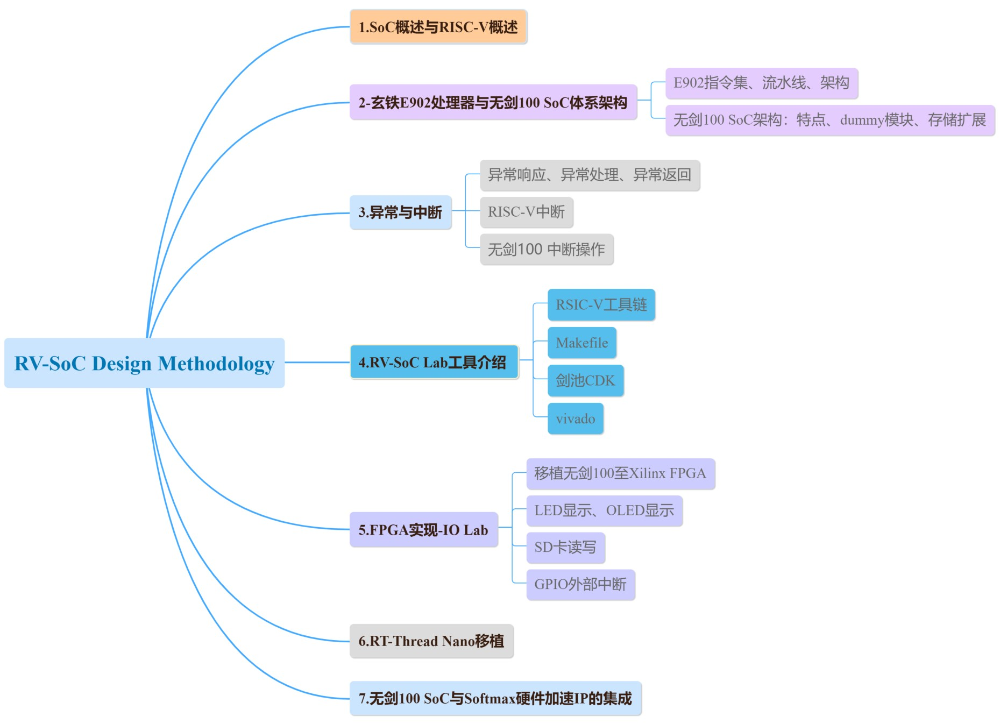
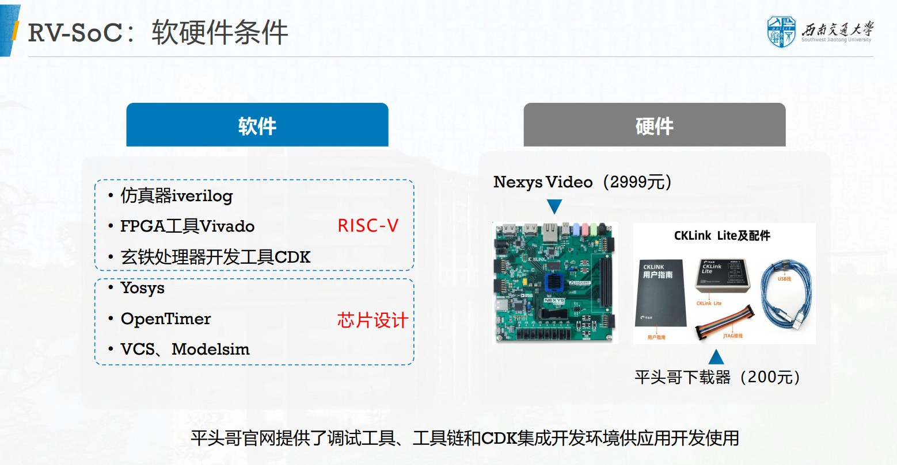

RV-SoC design Methodology Based on T-Head E902
===

“无剑100”开源SoC采用平头哥半导体公司自主研发的玄铁处理器核E902，是一款具有极低功耗、极低成本的嵌入式CPU核，主要面向智能卡、智能电网、低成本微控制器、无线传感网络等嵌入式应用。本课程基于平头哥E902与“无剑100”，重点讲诉无剑架构、SoC集成、RTT移植等内容。提升系统能力培养，推进课程开源，支持国产处理器！

[课程主页，课程视频请戳此链接](https://www.icourse163.org/course/SWJTU-1207492806)。
- 中国大学MOOC平台，免费注册学习！练习、作业、考试题请见“中国大学MOOC”。
- 教师可以联系邮箱zxdi@home.swjtu.edu.cn获取课程所有作业参考答案。

课程概述
---
本课程的教学内容主要包括：

课程所需软件硬件
---

课程slides
---
TBD

课程源代码
---
TBD

