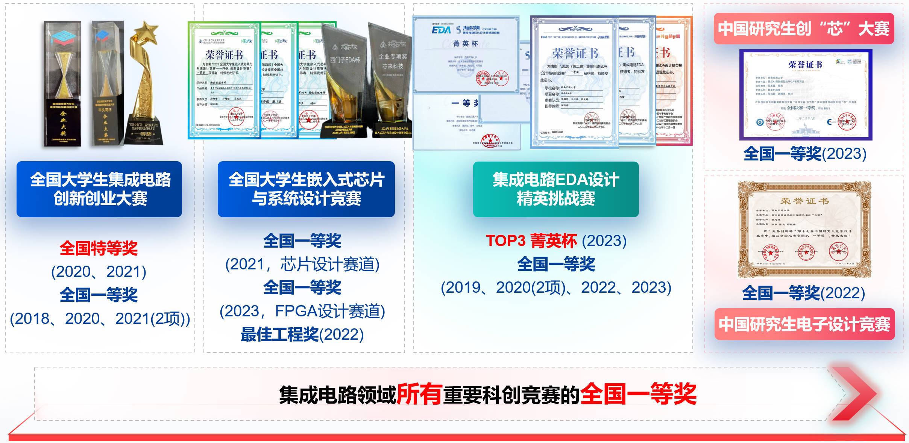

教师简介
---  
  
  
邸志雄，博士，副教授，西南交通大学集成电路科学与工程学院副院长，研究方向为数字芯片物理实现算法、高性能图像编解码芯片设计、数字芯片设计、FPGA加速器设计等。主持国家自然科学基金面上项目、青年基金项目、四川省科技厅重点项目等多项纵向项目，与华为海思、上海安路科技等业界顶尖企业有多项横向合作项目。在IEEE TCAS-Ⅰ、IEEE TCAD、IEEE TCAS-Ⅱ、IEEE TIE、IEEE GRSL、IEEE TCSVT、DAC、ASP-DAC、GLS-VLSI、电子学报等国际与国内学术顶级期刊和会议发表论文多篇。担任电路与系统顶级期刊IEEE TCAS-Ⅱ Guest Editor，担任ISEDA、CCF-DAC等多个学术会议Chair；担任“华为杯”中国研究生创“芯”大赛专家委员会秘书，全国大学生集成电路创新创业大赛专家委员成员，集成电路EDA精英挑战赛专家委员副主任。获2020年“詹天佑-教书育人奖”、2021年阿里云第16期 MVP、2022年教育部—华为“智能基座”优秀教师奖励等（2022年全国仅入选20人）。主讲MOOC课程“硬件加速设计方法”，选课人数逾2万人，2022年入选四川省一流线上课程，入选2021年教育部产学合作协同育人优秀案例；指导学生在科创竞赛获国家级奖励40余项，其中国家级一等奖（含特等奖）10余项。

首页目录
---
1.新闻  
2.科研与代表性论文  
3.MOOC课程详细信息(配套slides下载等)  
4.线下承担课程教学工作  
5.学科竞赛获奖  
6.联系方式  
7.芯片设计笔试题与面试题（持续收集与更新...）  
8.招生要求  
9.指导学生毕业去向  
10.友情链接  

1.实验室动态  
---
- [更多新闻请戳此链接](./LabNews)
- 2024.05，祝贺实验室硕士生陈千禧、陶润哲、邓雨姣同学在ISEDA'2024中被郝跃院士颁发“集成电路EDA设计精英挑战赛”TOP3“菁英杯”大奖！
- 2024.04，祝贺实验室硕士生陶润哲同学入选省优秀毕业生；实验室硕士生陈林、本科生付秋涛同学入选校级优秀毕业生！
- 2024.04，祝贺一篇论文被GLS-VLSI'2024（CCF-C）的“microelectronics system education” track录用，“TITLE: A Design of Remote FPGA Experimental Teaching System Supporting Single-Board Multi-User and Multi-Board Single-User for MOOCs”，基于Xilinx DFX技术和PYNQ框架的远程FPGA系统，这个工作也是2023年全国大学生嵌入式芯片与系统设计竞赛（FPGA设计赛道）的全国一等奖获奖作品！
- 2023.12，祝贺实验室毕业生陈旋同学的硕士学位论文“面向SAR图像压缩芯片的软件模型及硬件物理设计优化研究”被评为西南交通大学2023年度优秀硕士学位论文！  
- 2023年12月24日，祝贺实验室硕士生在第五届集成电路EDA精英挑战赛中荣获一等奖、二等奖、三等奖各一项。尤其是在“超大规模版图图形匹配算法”赛题中获得赛题第一名，并捧得赛事最高奖之一的“菁英杯”！[西南交大报道](https://news.swjtu.edu.cn/info/1011/48525.htm)    
- 2023年12月23日，祝贺实验室本科生杨欣睿同学在全国先进计算技术创新大赛中荣获二等奖，在飞腾处理器上，从算法设计到汇编实现做了全方面的优化，将FFT算子性能在arm架构处理器上提升了数倍！[先进计算技术创新大赛报道](http://www.ac-innovation.com/eventDynamics/imnewsDetail?_t=6cp1ljNZ8kIAFtTRU5Ls2pSk%2BS8AjJvCTmKodYBeKj0%3D)    
- 2023年12月2日-12月3日，2023年第六届“全国大学生嵌入式芯片与系统设计竞赛”FPGA设计赛道与芯片设计赛道全国总决赛在南京举行。实验室参赛队伍荣获全国一等奖、全国二等奖各一项，其中：本科生队伍在FPGA设计赛道中荣获全国一等奖，创我校在该赛道中的历史最佳成绩；实验室与北京微电子技术研究所联合组队的硕士研究生队伍在芯片设计赛道中荣获全国二等奖！[西南交大报道](https://news.swjtu.edu.cn/info/1011/45795.htm)   
- 2023.11，祝贺陶润哲同学的论文"LEAPS: Topological-Layout-Adaptable Multi-die FPGA Placement for Super Long Line Minimization"被IEEE TCAS-1录用！ 
- 2023.11，祝贺陶润哲同学的论文"Imbalanced Large Graph Learning Framework for FPGA Logic Elements Packing Prediction"被IEEE TCAS-2录用！  
- 2023.08，祝贺实验室三位本科生荣获全国大学生集成电路创新创业大赛飞腾处理器赛道全国二等奖！同学们针对飞腾CPU架构的特点，提出了一种基于帧间预测和照度生成的高速LIME算法，协同使用NEON、OpenMP等将LIME算法在飞腾CPU上的运行效率加速218倍；针对飞腾CPU架构，构建了JPEG、SM4、TinyMaix等常用加速函数库，为飞腾CPU的生态建设贡献了一点点工作！ 
- 2023.08，祝贺实验室研究生队伍（陶润哲、谢雨池、陈林）荣获第六届“华为杯”中国研究生创“芯”大赛全国一等奖！[西南交大研究生院报道](https://gsnews.swjtu.edu.cn/info/1068/6803.htm) 
- 2023.07，祝贺实验室两组本科生队伍分别荣获第七届全国大学生集成电路创新创业大赛西南赛区一等奖、二等奖！
- 2023.05, 祝贺实验室硕士生陈旋（论文：-面向SAR图像压缩芯片的软件模型及硬件物理设计优化研究）、邵桢瑜（论文：基于软硬件协同搜索的SAR图像压缩加速器自动化设计方法）、陈卓（论文：基于缓存优化的ZynqNet硬件加速器设计）顺利通过答辩。 
- 2023.05, 祝贺实验室本科生范峻凌（论文：基于学习方法的时序预测模型设计）、梁国琦（论文：多实例化分块布图下的顶层布线算法研究）、王雄（论文：基于FPGA的手写数字识别系统设计）、颜飞扬（论文：FPGA加速器高效敏捷生成器设计）、黄亦成（论文：国密SM2算法核心点乘硬件加速器IP设计）、超松（论文：基于生成器的可重构阵列电路设计）顺利通过答辩。 
- 2023.05, 祝贺实验室本科生徐启涵同学（现中科院读研）、向云帆（现中科院读研）学术论文IEEE GRSL’2022入选第十五届全国大学生创新创业年会学术论文展。[西南交大官网报道](https://news.swjtu.edu.cn/info/1011/37906.htm).     
- 2023.04, 祝贺邸志雄老师主讲的MOOC课程《硬件加速设计方法》入选“成渝地区双城经济圈普通本科高校智慧教育优秀案例”。  
- 2023.03, 祝贺实验室硕士生陈旋，入选 SWJTU研·人物 | 【竢实扬华奖章】陈旋：始于初“芯”，忠于初心。[西南交大学生处官网公众号报道](https://mp.weixin.qq.com/s/R1QKYuWrer3ZD-Wu8YRUdg) 
- 2023.03, 祝贺实验室硕士生陈旋、邵桢瑜、本科生颜飞扬入选四川省优秀毕业生；实验室本科生黄亦成、超松入选校级优秀毕业生。 
- 2022.12, 祝贺实验室硕士生陈旋同学荣获学校授予学生的最高荣誉“竢实扬华”奖章，本年度全校仅授予4名硕士研究生。
- 2022.12, 祝贺实验室两支队伍在“第四届集成电路EDA设计精英挑战赛”中荣获全国一等奖1项（入围TOP 9路演），全国二等奖1项。时隔两年，实验室的参赛队伍再次进入路演，角逐大奖。（1）陶润哲、陈林、范峻凌（本科），荣获行芯赛题“感知物理信息的智能化时序估算模型”第一名，作品构建了SPEF读取的多线程映射与加速方法，设计了丰富而准确的特征库，提出了一种高准确率的延迟预测模型；（2）谢雨池、向瀚章、卢锦程（本科），荣获新思赛题“多实例化分块布图下的顶层布线”全国二等奖，针对赛题的需求对现有GR、DR、mazerouting等框架进行了优化和适配。[西南交大官网报道](https://news.swjtu.edu.cn/info/1013/36394.htm)
- 2022.12, 祝贺实验室一支研究生队伍、一支本科生队伍获“全国大学生嵌入式芯片与系统设计竞赛——FPGA 创新设计竞赛” （国家级A类竞赛）全国二等奖1项，全国三等奖1项；其中，全国二等奖作品因系统复杂、工程能力强，荣获大赛颁发的“最佳工程奖”。
- 2022.11，祝贺邸志雄老师入选2022年度教育部——华为“智能基座”优秀教师奖励计划！（本年度全国仅20人入选）[官方报道](https://mp.weixin.qq.com/s/pG-FEUk5a73Hjn5xi-jGow)
- 2022.12, 祝贺实验室一支研究生队伍、一支本科生队伍获“全国大学生嵌入式芯片与系统设计竞赛——FPGA 创新设计竞赛” （国家级A类竞赛）全国二等奖1项，全国三等奖1项；其中，全国二等奖作品因系统复杂、工程能力强，荣获大赛颁发的“最佳工程奖”。

2.科研与代表性论文
---
- [科研详情请戳此链接](./research)

3.MOOC课程详细信息(配套slides下载等)
---  

- [中国大学MOOC平台：芯动力——硬件加速设计方法](./class1)

- [B站：数字集成电路静态时序分析基础](./class2)
 
- [RV-SoC Design Methodology Based on T-Head E902](./class5)  

- [从电路设计的角度入门VerilogHDL](./class6)

4.线下承担课程教学工作
---  

- [详细信息](./class3)

5.学科竞赛获奖
---
（未计入省级奖励）

- 荣获集成电路领域所有重要科创竞赛的全国一等奖，共计16项。  
- 荣获中国研究生创“芯”大赛全国一等奖1项（2023年），迄今为止西南交大在创芯大赛中唯一一个全国一等奖！  
- 荣获中国研究生电子设计竞赛全国一等奖1项（2022年），2022年西南交大最好成绩！    
- 荣获全国大学生集成电路创新创业大赛全国特等奖2项（2020、2021）、全国一等奖4项（2018、2020、2021（2项）），实验室迄今保持西南交大在集创赛中奖项等级最高、数量最多的记录！  
- 荣获全国大学生嵌入式系统与芯片设计竞赛全国一等奖1项（2023年；2021年芯片设计赛道全国本科组唯一一等奖）、最佳工程奖1项（仅授予一等奖或者极少数二等奖中工程能力扎实全面的作品）；实验室迄今保持西南交大在FPGA赛道、芯片设计赛道中全校最好成绩！  
- 集成电路EDA设计精英挑战赛菁英杯（TOP3）1项、全国冠军3项、全国一等奖5项（2019、2020（2项）、2022、2023），实验室迄今保持西南交大在该赛事中奖项等级最高、数量最多的记录！  
 

部分获奖作品展示：
- 2018年，第二届全国大学生集成电路创新创业大赛全国一等奖、第二届全国大学生集成电路创新创业大赛优秀指导教师；[Softmax函数的硬件加速计算电路设计](https://github.com/CustomizableComputingLab/PYNQ_softmax)  
- 2019年，集成电路设计EDA精英挑战赛全国一等奖、Cadence企业特别奖、华大九天企业特别奖；[一等奖作品：基于Cadence工具的数字芯片层次化物理设计](https://zhuanlan.zhihu.com/p/153232123)
- 2020年，第二届集成电路设计EDA精英挑战赛全国一等奖2项、企业特别奖2项；[一等奖作品：verilog多驱动检查（芯华章赛题）](https://github.com/jakio6/iverilog)
- 2020年，“2020第二届集成电路EDA设计精英挑战赛” 中“赛题八：FPGA布局合法化问题”全国一等奖，[讲解视频](https://www.nicu.cn/practiceCourseDetails?area=1&type=0&id=9&choiceOrder=2) 
- 2020年，“2020第二届集成电路EDA设计精英挑战赛” 中“赛题四：时序模块驱动冲突的检查”全国一等奖，[讲解视频](https://www.nicu.cn/practiceCourseDetails?area=1&type=0&id=36&choiceOrder=2) 

6.联系方式
---  
- [邮箱：zxdi@home.swjtu.edu.cn]
- [请加教师微信，加入课程微信群]  

  
  
  
 - [请加关注教师微信公众号“硬件加速与EDA”，下载MOOC课程课件与习题答案]   
   

 - 欢迎关注教师B站账号“讲芯片的邸老师”、知乎ID“Forever snow”、小红书“讲芯片的邸老师”       

7.芯片设计笔试题与面试题（持续收集与更新...）
---
- [详情请戳此链接](./examination)
  
8.招生要求（不一定满足，但是偏好有如下经历的学生）
---
- 数字芯片设计与硬件加速方向：熟悉VerilogHDL/HLS/Chisel等；喜欢或者熟悉数字芯片设计流程、FPGA、嵌入式系统；如有全国大学生集成电路创新创业大赛、嵌入式大赛、FPGA大赛、电子设计大赛等等相关比赛获奖经历更好。
- EDA算法方向：熟悉C/C++等；熟悉数据结构和常用算法等；如有数学建模大赛、EDA精英挑战赛、全国大学生集成电路创新创业大赛算法题目等算法相关比赛获奖经历更好。  

9.指导学生毕业去向
---
- [详情请见此链接](./stu)

友情链接
---
- [B站账号“讲芯片的邸老师”](https://space.bilibili.com/382647602)  
- [知乎ID“Forever snow”](https://www.zhihu.com/people/Foreversnow)    
- [EDA/VLSI/FPGA Conferences](https://www.cse.chalmers.se/research/group/vlsi/conference/)  
- [西安电子科技大学通信工程学院潘伟涛老师微信公众号：网络交换与FPGA]

- [宽带隙半导体国家重点学科实验室](http://kdx.xidian.edu.cn/)
- [集成电路EDA设计精英挑战赛](http://eda.icisc.cn/)
- [开源FPGA：轻量级边缘计算加速卡 Spartan Edge Accelerator主页（github，推荐国外IP访问）](https://donesea.github.io)  
- [开源FPGA：轻量级边缘计算加速卡 Spartan Edge Accelerator主页（gitee，推荐国内IP访问）](https://gitee.com/SEA-S7/SEA)
