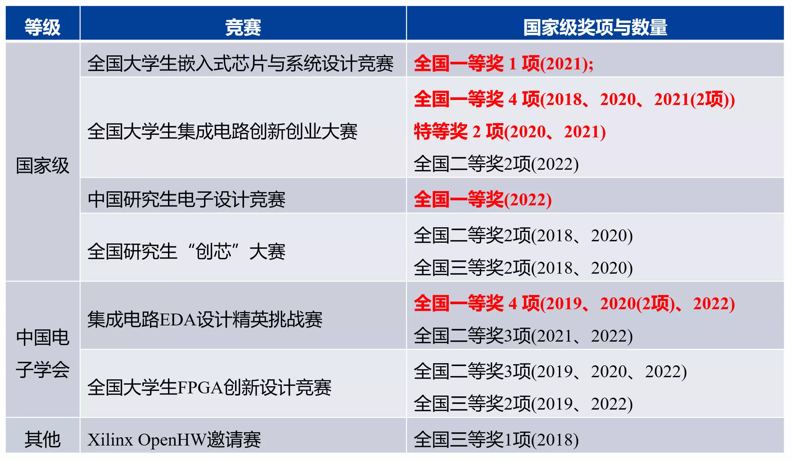

教师简介
---  
  
  
邸志雄，博士，副教授，硕士生导师，西南交通大学信息学院电子系副系主任，研究方向为数字芯片物理实现EDA算法，高性能图像编解码芯片设计、FPGA硬件加速设计。主持国家自然科学基金、四川省科技厅重点项目。参与完成了我国自主研制的首颗宇航级高速图像压缩芯片“雅芯-天图”。在IEEE GRSL、IEEE TCAS-Ⅱ、IEEE TIE、IEEE TCSVT、DAC、ASP-DAC、GLS-VLSI、电子学报等发表论文多篇。四川省一流线上课程负责人，获2020年“詹天佑-教书育人奖”、2021年阿里云第16期 MVP、2022年教育部—华为“智能基座”优秀教师奖励等。主讲MOOC课程“硬件加速设计方法”，选课人数逾两万人，入选2021年教育部产学合作协同育人优秀案例；指导学生科创竞赛获国家级奖励40余项。

首页目录
---
1.新闻  
2.科研与代表性论文  
3.MOOC课程详细信息(配套slides下载等)  
4.线下承担课程教学工作  
5.学科竞赛获奖  
6.联系方式  
7.芯片设计笔试题与面试题（持续收集与更新...）  
8.招生要求  
9.指导学生毕业去向  
10.友情链接  

1.新闻
---
- [更多新闻请戳此链接](./LabNews)
- 2023.05, 祝贺实验室硕士生陈旋（论文：-面向SAR图像压缩芯片的软件模型及硬件物理设计优化研究）、邵桢瑜（论文：基于软硬件协同搜索的SAR图像压缩加速器自动化设计方法）、陈卓（论文：基于缓存优化的ZynqNet硬件加速器设计）顺利通过答辩。 
- 2023.05, 祝贺实验室本科生范峻凌（论文：基于学习方法的时序预测模型设计）、梁国琦（论文：多实例化分块布图下的顶层布线算法研究）、王雄（论文：基于FPGA的手写数字识别系统设计）、颜飞扬（论文：FPGA加速器高效敏捷生成器设计）、黄亦成（论文：国密SM2算法核心点乘硬件加速器IP设计）、超松（论文：基于生成器的可重构阵列电路设计）顺利通过答辩。 
- 2023.05, 祝贺实验室本科生徐启涵同学（现中科院读研）学术论文IEEE GRSL’2022入选第十五届全国大学生创新创业年会学术论文展。 
- 2023.04, 祝贺邸志雄老师主讲的MOOC课程《硬件加速设计方法》入选“成渝地区双城经济圈普通本科高校智慧教育优秀案例”。  
- 2023.03, 祝贺实验室硕士生陈旋，入选 SWJTU研·人物 | 【竢实扬华奖章】陈旋：始于初“芯”，忠于初心。[西南交大学生处官网公众号报道](https://mp.weixin.qq.com/s/R1QKYuWrer3ZD-Wu8YRUdg) 
- 2023.03, 祝贺实验室硕士生陈旋、邵桢瑜、本科生颜飞扬入选四川省优秀毕业生；实验室本科生黄亦成、超松入选校级优秀毕业生。 
- 2022.12, 祝贺实验室硕士生陈旋同学荣获学校授予学生的最高荣誉“竢实扬华”奖章，本年度全校仅授予4名硕士研究生。
- 2022.12, 祝贺实验室两支队伍在“第四届集成电路EDA设计精英挑战赛”中荣获全国一等奖1项（入围TOP 9路演），全国二等奖1项。时隔两年，实验室的参赛队伍再次进入路演，角逐大奖。（1）陶润哲、陈林、范峻凌（本科），荣获行芯赛题“感知物理信息的智能化时序估算模型”第一名，作品构建了SPEF读取的多线程映射与加速方法，设计了丰富而准确的特征库，提出了一种高准确率的延迟预测模型；（2）谢雨池、向瀚章、卢锦程（本科），荣获新思赛题“多实例化分块布图下的顶层布线”全国二等奖，针对赛题的需求对现有GR、DR、mazerouting等框架进行了优化和适配。[西南交大官网报道](https://news.swjtu.edu.cn/info/1013/36394.htm)
- 2022.12, 祝贺实验室一支研究生队伍、一支本科生队伍获“全国大学生嵌入式芯片与系统设计竞赛——FPGA 创新设计竞赛” （国家级A类竞赛）全国二等奖1项，全国三等奖1项；其中，全国二等奖作品因系统复杂、工程能力强，荣获大赛颁发的“最佳工程奖”。
- 2022.11，祝贺邸志雄老师入选2022年度教育部——华为“智能基座”优秀教师奖励计划！（本年度全国仅20人入选）[官方报道](https://mp.weixin.qq.com/s/pG-FEUk5a73Hjn5xi-jGow)
- 2022.12, 祝贺实验室一支研究生队伍、一支本科生队伍获“全国大学生嵌入式芯片与系统设计竞赛——FPGA 创新设计竞赛” （国家级A类竞赛）全国二等奖1项，全国三等奖1项；其中，全国二等奖作品因系统复杂、工程能力强，荣获大赛颁发的“最佳工程奖”。

2.科研与代表性论文
---
- [科研详情请戳此链接](./research)

3.MOOC课程详细信息(配套slides下载等)
---  

- [中国大学MOOC平台：芯动力——硬件加速设计方法](./class1)

- [B站：数字集成电路静态时序分析基础](./class2)
 
- [RV-SoC Design Methodology Based on T-Head E902](./class5)  

- [从电路设计的角度入门VerilogHDL](./class6)

4.线下承担课程教学工作
---  

- [详细信息](./class3)

5.学科竞赛获奖
---
（未计入省级奖励）

部分获奖作品展示：
- 2018年，第二届全国大学生集成电路创新创业大赛全国一等奖、第二届全国大学生集成电路创新创业大赛优秀指导教师；[Softmax函数的硬件加速计算电路设计](https://github.com/CustomizableComputingLab/PYNQ_softmax)  
- 2019年，集成电路设计EDA精英挑战赛全国一等奖、Cadence企业特别奖、华大九天企业特别奖；[一等奖作品：基于Cadence工具的数字芯片层次化物理设计](https://zhuanlan.zhihu.com/p/153232123)
- 2020年，第二届集成电路设计EDA精英挑战赛全国一等奖2项、企业特别奖2项；[一等奖作品：verilog多驱动检查（芯华章赛题）](https://github.com/jakio6/iverilog)
- 2020年，“2020第二届集成电路EDA设计精英挑战赛” 中“赛题八：FPGA布局合法化问题”全国一等奖，[讲解视频](https://www.nicu.cn/practiceCourseDetails?area=1&type=0&id=9&choiceOrder=2) 
- 2020年，“2020第二届集成电路EDA设计精英挑战赛” 中“赛题四：时序模块驱动冲突的检查”全国一等奖，[讲解视频](https://www.nicu.cn/practiceCourseDetails?area=1&type=0&id=36&choiceOrder=2) 

6.联系方式
---  
- [邮箱：zxdi@home.swjtu.edu.cn]
- [请加教师微信，加入课程微信群]  

  
  
  
 - [请加关注教师微信公众号“硬件加速与EDA”，下载MOOC课程课件与习题答案]   
    

7.芯片设计笔试题与面试题（持续收集与更新...）
---
- [详情请戳此链接](./examination)
  
8.招生要求（不一定满足，但是偏好有如下经历的学生）
---
- 数字芯片设计与硬件加速方向：熟悉VerilogHDL/HLS/Chisel等；喜欢或者熟悉数字芯片设计流程、FPGA、嵌入式系统；如有全国大学生集成电路创新创业大赛、嵌入式大赛、FPGA大赛、电子设计大赛等等相关比赛获奖经历更好。
- EDA算法方向：熟悉C/C++等；熟悉数据结构和常用算法等；如有数学建模大赛、EDA精英挑战赛、全国大学生集成电路创新创业大赛算法题目等算法相关比赛获奖经历更好。  

9.指导学生毕业去向
---
- [详情请见此链接](./stu)

友情链接
---
- [EDA/VLSI/FPGA Conferences](https://www.cse.chalmers.se/research/group/vlsi/conference/)  
- [西安电子科技大学通信工程学院潘伟涛老师微信公众号：网络交换与FPGA]

- [宽带隙半导体国家重点学科实验室](http://kdx.xidian.edu.cn/)
- [集成电路EDA设计精英挑战赛](http://eda.icisc.cn/)
- [开源FPGA：轻量级边缘计算加速卡 Spartan Edge Accelerator主页（github，推荐国外IP访问）](https://donesea.github.io)  
- [开源FPGA：轻量级边缘计算加速卡 Spartan Edge Accelerator主页（gitee，推荐国内IP访问）](https://gitee.com/SEA-S7/SEA)
