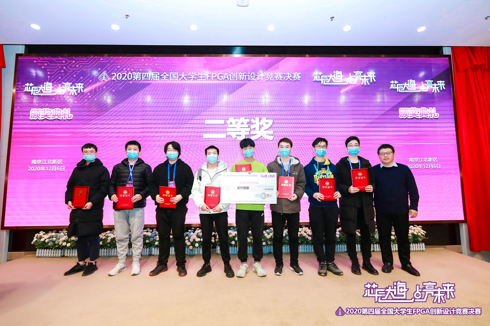
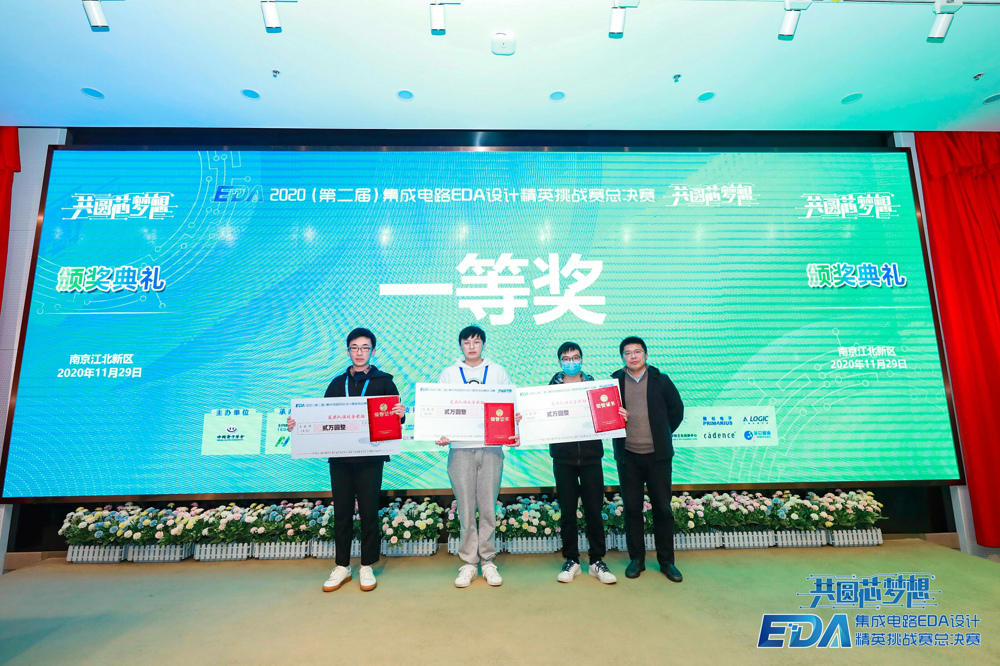
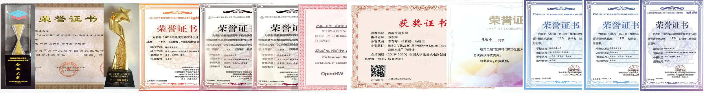
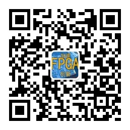

教师简介
---  
  
  
邸志雄，博士，硕士研究生导师，西南交通大学信息学院电子工程系副系主任。IEEE会员，IEEE CEDA、ACM SIGDA成员，CCF会员、中国图象图形学学会图像应用与系统集成专委会成员、新工科联盟“可定制计算”专委会成员。研究方向为高性能图像编解码芯片技术研究、布局布线算法研究。  
- 近年来主持国家自然科学基金青年项目、四川省科技厅项高新重点项目等项目，参与完成了我国自主研制的首颗宇航级高速图像压缩芯片“雅芯-天图”（已应用于“嫦娥”系列探月工程、“天舟一号”货运飞船等）。
- 联合设计的边缘计算加速卡（Xilinx Spartan-7 Edge Accelerator FPGA Board）已在国内部分高校、工业界，以及美国、荷兰、德国、越南的国家的青少年教育中应用。
- 在EDA算法领域，提出了多种数字芯片物理实现算法，在国内多个竞赛中获得国家级奖项，部分算法已成功应用于商业芯片的设计流程中。
- 学术服务方面：担任2020年 CCF-DAC分论坛主席，担任IEEE TCSVT、IEEE TCAD、IEEE TCAS Ⅱ、北京邮电大学学报、中文核心期刊《微电子学》审稿人。
- 社会服务方面：全国高等学校计算机教学与产业实践资源建设专家委员会执行委员，全国大学生集成电路创新创业大赛专家委员会成员，集成电路EDA设计精英挑战赛专家委员会成员。多次担任中国研究生电子设计大赛、中国研究生创新实践系列大赛“华为杯”中国研究生创“芯”大赛、“全国大学生嵌入式芯片与系统设计暨第四届智能互联创新大赛”、“全国大学生FPGA创新设计竞赛”、“集成电路设计EDA精英挑战赛”等学科竞赛的全国总决赛评审。 

- [如果访问速度太慢，可以点击gitee主页](https://customizablecomputinglab.gitee.io/)  

1.新闻
---

- 2021.06，祝贺两位本科生徐启涵、向云帆同学的工作“Synthetic Aperture Radar Image Compression Based on a Variational Autoencoder”被IEEE Geoscience Remote Sensing Letters录用！
- 2021.06，祝贺两位毕业的同学：祝贺硕士生吴伟同学（SP Offer）加入华为海思，祝贺本科生刘已秋同学（SSP Offer）加入国产EDA公司奥卡思微电子！
- 2021.06，祝贺指导的本科生顺利通过答辩！
    | 水果        | 价格    |  数量  |
    | --------   | -----:   | :----: |
    | 香蕉        | $1      |   5    |
    | 苹果        | $1      |   6    |
    | 草莓        | $1      |   7    |

- 2021.06，祝贺陈旋、吴伟同学的工作“Detailed Routing Short Violation Prediction Using Graph-based Deep Learning Model”被TCAS2录用！文章提出了一种布局阶段基于GNN的routability预测模型，能够在小规模数据集上实现目前最强的泛化能力。
- 2021.06，荣获2021年“阿里云MVP”！
- 2021.06，祝贺邵桢瑜同学的工作"A High-Throughput VLSI Architecture Design Of Canonical Huffman Encoder"被IEEE TCAS2录用。
- 2021.04，教学论文“ASIC Design Principle Course with Combination of Online-MOOC and Offline-Inexpensive FPGA Board”被微电子与集成电路领域知名国际学术会议“2021 31th ACM Great Lakes Symposium on VLSI”(CCF-C)录用（Oral Report; Panel 嘉宾）。该论文系西南交大微电子学科首次在集成电路国际学术会议展示教学成果。该论文相关教学改革工作被“电子学报”官网首页头条报道（2021.5.30）、被中国电子电子学会官网、“电子学报”公众号、“中国电子学会”公众号报道。
- 2021.01.12，荣获2020年“詹天佑铁道科学技术奖”之“教书育人”专项奖！
- 2020.12.06，祝贺研一陈卓同学的作品“基于Xilinx DPU的芯片表面缺陷检测硬件加速系统”荣获“2020第四届全国大学生FPGA创新设计竞赛”全国二等奖！  

- 2020.12.01，第二届EDA精英挑战赛圆满落幕，作为国内水平最高的EDA算法竞赛，本次竞赛得到了几乎国内所有EDA公司、国际三大EDA巨头、国产FPGA公司安路、华为海思的支持，硕博参赛比例接近80%！祝贺本实验室学生获得两项一等奖！1.研二学生陈锦炜带领两位大四师妹，荣获FPGA  CAD赛道(命题公司安路科技)第一名，团队提出一种新的FPGA布局合法化算法，在10个benchmark中9个排名第1、1个排名第二，以高出第二名接近15分(百分制)的巨大优势获得赛题冠军；锦炜同学继2019年后再获一项一等奖。2.大四学生刘已秋以一人之力，获得Verilog多驱动解析赛道(命题公司芯华章)一等奖，其中算法benchmark测试为仅有的两支满分队伍之一，笔试成绩第一。感谢大赛组委会！！ 

- 2020.11.03，祝贺硕士生陈旋提出的“Detailed Routing Short Violations Prediction Method Using Graph Neural Network”和陈锦炜提出的“An Enhanced Heuristic Layer Assignment Method in Global Routing”在ICSICT2020做口头汇报！
- 2020.10.30，祝贺本科生刘已秋同学加入国产知名EDA公司奥卡思微电子！
- 2020.10.13，祝贺硕士生邵桢瑜同学“JPEG图像编解码FPGA系统”荣获中国研究生“创芯”大赛企业杯二等奖！
- 2020.09.01，祝贺硕士生陈锦炜同学关于FPGA布线算法的作品荣获“复微杯电子设计竞赛”优秀奖！  
- 2020.08.23，祝贺与复旦大学ASIC重点实验室范益波教授合作的项目“基于硬件的JPEG无损编码及转码系统项目”荣获阿里巴巴创新研究计划优秀学术项目奖！  
- 2020.08.23，祝贺2017级本科生马晓宝同学、陈春晖同学、徐新权同学荣获2020年“第四届全国大学生集成电路创新创业大赛” 全国一等奖，并摘得大赛最高奖项“RISC-V挑战杯”（等同特等奖，仅颁发给一等奖第一名）！  
- 2020.07.21，祝贺2017级本科生马晓宝同学与陈春晖同学荣获2020年“第四届全国大学生集成电路创新创业大赛”西南赛区一等奖，并入围全国总决赛！  
- 2020.07.17，祝贺2016级本科生林思成同学入职国产FPGA顶尖公司“紫光同创”！

2.MOOC课程详细信息(配套slides下载等)
---  

- 提示：如果github网站访问速度较慢，可以访问gitee的主页，方便下载课件；[gitee主页](https://customizablecomputinglab.gitee.io)。

- [中国大学MOOC平台：芯动力——硬件加速设计方法。](./class1)

- [B站：数字集成电路静态时序分析基础。](./class2)

3.线下承担课程教学工作
---  

- [详细信息](./class3)

4.学科竞赛作品
---

陆续开源中...：
- 2016年，参加第六届(2016年)大学生集成电路设计大赛，获全国三等奖；
- 2017年，“华为杯”研究生电子设计大赛首届集成电路专业赛决赛全国二等奖1次，全国三等奖1次，企业奖2项；
- 2018年，第二届全国大学生集成电路创新创业大赛全国一等奖、第二届全国大学生集成电路创新创业大赛优秀指导教师；[Softmax函数的硬件加速计算电路设计](https://github.com/CustomizableComputingLab/PYNQ_softmax)  
- 2018年，Xilinx OpenHW全国总决赛全国三等奖；
- 2019年，全国研究生“创芯”大赛全国三等奖；
- 2019年，集成电路设计EDA精英挑战赛全国一等奖、Cadence企业特别奖、华大九天企业特别奖；[一等奖作品：基于Cadence工具的数字芯片层次化物理设计](https://zhuanlan.zhihu.com/p/153232123)
- 2019年，第三届FPGA创新设计大赛全国二等奖与三等奖各1项。  
- 2020年，第二届集成电路设计EDA精英挑战赛全国一等奖2项、企业特别奖2项；[一等奖作品：verilog多驱动检查（芯华章赛题）](https://github.com/jakio6/iverilog)
- 2020年，第四届FPGA创新设计大赛全国二等奖1项；
- 2020年，全国研究生“创芯”大赛企业二等奖；
- 2020年，复微杯电子设计大赛全国优秀奖；
- 2020年，“第四届全国大学生集成电路创新创业大赛” 全国一等奖，并摘得大赛最高奖项“RISC-V挑战杯”（等同特等奖，仅颁发给一等奖第一名）；  

- 2020年，“2020第二届集成电路EDA设计精英挑战赛” 中“赛题八：FPGA布局合法化问题”全国一等奖，[讲解视频](https://www.nicu.cn/practiceCourseDetails?area=1&type=0&id=9&choiceOrder=2) 
- 2020年，“2020第二届集成电路EDA设计精英挑战赛” 中“赛题四：时序模块驱动冲突的检查”全国一等奖，[讲解视频](https://www.nicu.cn/practiceCourseDetails?area=1&type=0&id=36&choiceOrder=2) 

5.科研工作
---  
- [科研详情请戳此链接](./research)

- [邮箱：zxdi@home.swjtu.edu.cn]
- [请加教师微信，加入课程微信群]  

  
  
  
 - [请加关注教师微信公众号“硬件加速与EDA”，下载MOOC课程课件与习题答案]   
    

6.技术科普与解读
---
- [视频与文章](./tech_paper)

7.芯片设计笔试题与面试题（持续收集与更新...）
---
- [详情请戳此链接](./examination)
  

友情链接
---

- [西安电子科技大学通信工程学院潘伟涛老师微信公众号：网络交换与FPGA]

- [宽带隙半导体国家重点学科实验室](http://kdx.xidian.edu.cn/)
- [集成电路EDA设计精英挑战赛](http://eda.icisc.cn/)
- [开源FPGA：轻量级边缘计算加速卡 Spartan Edge Accelerator主页（github，推荐国外IP访问）](https://donesea.github.io)  
- [开源FPGA：轻量级边缘计算加速卡 Spartan Edge Accelerator主页（gitee，推荐国内IP访问）](https://gitee.com/SEA-S7/SEA)
