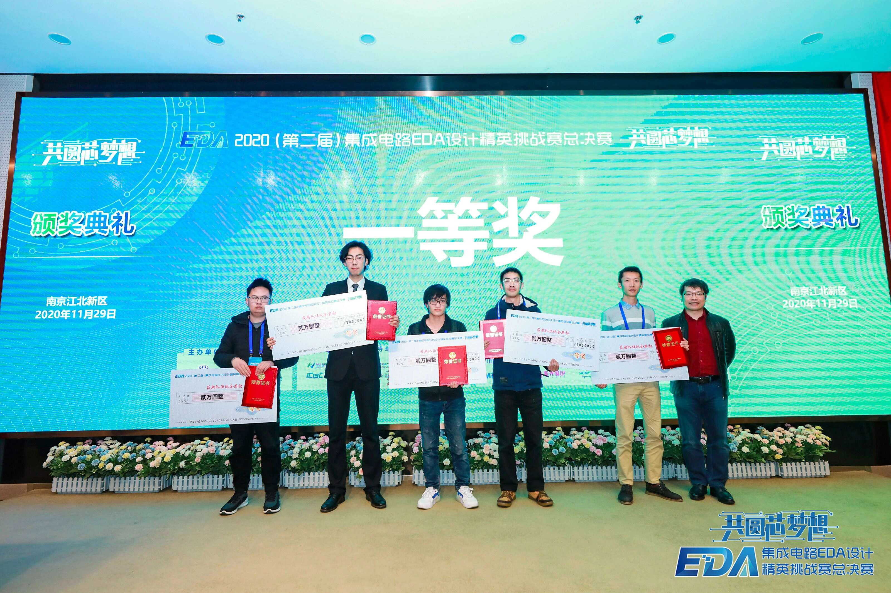

教师简介
---  
  
  
邸志雄，博士，硕士研究生导师，西南交通大学信息学院电子工程系副系主任。研究方向为高性能图像编解码芯片技术研究、布局布线算法研究。  
- 近年来主持国家自然科学基金青年项目、四川省科技厅项高新重点项目等项目，参与完成了我国自主研制的首颗宇航级高速图像压缩芯片“雅芯-天图”（已应用于“嫦娥”系列探月工程、“天舟一号”货运飞船等）。联合设计的边缘计算加速卡（Xilinx Spartan-7 Edge Accelerator FPGA Board）已在国内部分高校、工业界，以及美国、荷兰、德国、越南的国家的青少年教育中应用。提出了多种数字芯片物理实现算法，在国内多个竞赛中获得国家级奖项，部分算法已成功应用于商业芯片的设计流程中。
- 学术服务：担任2020年 CCF-DAC分论坛主席；IEEE TCSVT、IEEE TCAD、IEEE TCAS-1、IEEE TCAS-2、MEJ、北京邮电大学学报、中文核心期刊《微电子学》等审稿人。
- 社会服务：IEEE会员，IEEE CEDA、ACM SIGDA成员，CCF会员；CCF集成电路设计专委会执行委员，CCF科普工委成员，中国图象图形学学会图像应用与系统集成专委会成员、新工科联盟“可定制计算”专委会成员。全国高等学校计算机教学与产业实践资源建设专家委员会执行委员，中国研究生创芯大赛专委会秘书，全国大学生集成电路创新创业大赛专家委员会成员，集成电路EDA设计精英挑战赛专家委员会成员，研电赛西南赛区执行委员。 

- [如果访问速度太慢，可以点击gitee主页](https://customizablecomputinglab.gitee.io/)  

首页目录
---
1.新闻  
2.代表性论文  
3.MOOC课程详细信息(配套slides下载等)  
4.线下承担课程教学工作  
5.学科竞赛获奖  
6.科研工作  
7.技术科普与解读  
8.芯片设计笔试题与面试题（持续收集与更新...）  
9.招生要求  
10.指导学生毕业去向  
11.友情链接  

1.新闻
---

- 2022.03，祝贺实验室6位同学荣获“信息科学与技术学院研究生提升基金”。

- 2022.03，祝贺实验室6位同学荣获“信息科学与技术学院研究生提升基金”。

- 2022.03，祝贺实验室研二硕士生邵桢瑜被推荐为“2021中国电子学会集成电路奖学金候选人”。
- 2022.02，祝贺B站“讲芯片的邸老师”粉丝突破1万人。
- 2022.02，祝贺实验室研二陈旋同学的工作"Learned Compression Framework with Pyramidal Features and Quality Enhancement for SAR images"被IEEE GRSL录用。
- 2021.12，祝贺实验室两组研究生同学在“2021第三届集成电路EDA设计精英挑战赛”新思科技2.5D布局算法赛道、国微multi-patterning DRC检测算法赛道荣获两项全国二等奖！祝贺锦炜同学因以去年安路科技赛道第一名作品为基础投稿IEEE TCAD（EDA领域顶级期刊）被录用论文，荣获大赛首次颁发的“学术进取奖”。有幸因连续三届指导学生获奖，被授予“EDA精心育人奖”。有幸因担任安路赛题chair，被授予“专业贡献奖”。感谢EDA精英挑战赛组委会！
- 2021.12，祝贺实验室研三陈锦炜同学的工作"NBLG: A Robust Legalizer for Mixed-Cell-Height Modern Design"被IEEE TCAD录用。
- 2021.12，《基于玄铁CPU与无剑SoC的芯片设计与应用产教融合精品慕课建设》课程体系改革项目成功入选2021年度教育部产学合作协同育人优秀项目案例。
- 2021.09，10月31日，全国大学生嵌入式芯片与系统设计竞赛全国总决赛成功在线上举办。我校信息科学与技术学院参赛队伍作品“海洋生物声学分类SoC芯片设计”（指导教师邸志雄；队员范峻凌、黄亦成、廖才进）在总决赛中发挥出色，荣获“芯片设计赛道”本科生组全国唯一的一等奖，并获“芯来科技杯”企业大奖。祝贺实验室本科生范峻凌、黄亦成同学！
- 2021.09，邸志雄老师荣获西南交通大学“立德树人”先进个人：“教书育人”新秀奖！
- 2021.08，第五届全国大学生集成电路创新创业大赛中，指导学生荣获 1 项特等奖、2 项一等奖、2 项三等奖！
  
- 2021.06，祝贺实验室两位本科生徐启涵、向云帆同学的工作“Synthetic Aperture Radar Image Compression Based on a Variational Autoencoder”被IEEE Geoscience Remote Sensing Letters录用！
- 2021.06，祝贺实验室两位毕业的同学：祝贺硕士生吴伟同学（SP Offer）加入华为海思，祝贺本科生刘已秋同学（SSP Offer）加入国产EDA公司奥卡思微电子！
- 2021.06，祝贺指导的本科生顺利通过答辩！  
  
- 2021.06，祝贺实验室研一陈旋、研三吴伟同学的工作“Detailed Routing Short Violation Prediction Using Graph-based Deep Learning Model”被TCAS2录用！文章提出了一种布局阶段基于GNN的routability预测模型，能够在小规模数据集上实现目前最强的泛化能力。
- 2021.06，邸志雄老师荣获2021年“阿里云MVP”！
  
- 2021.06，祝贺实验室研一邵桢瑜同学的工作"A High-Throughput VLSI Architecture Design Of Canonical Huffman Encoder"被IEEE TCAS2录用。
- 2021.04，教学论文“ASIC Design Principle Course with Combination of Online-MOOC and Offline-Inexpensive FPGA Board”被微电子与集成电路领域知名国际学术会议“2021 31th ACM Great Lakes Symposium on VLSI”(CCF-C)录用（Oral Report; Panel 嘉宾）。该论文系西南交大微电子学科首次在集成电路国际学术会议展示教学成果。该论文相关教学改革工作被“电子学报”官网首页头条报道（2021.5.30）、被中国电子电子学会官网、“电子学报”公众号、“中国电子学会”公众号报道。
  
- 2021.01.12，邸志雄老师荣获2020年“詹天佑铁道科学技术奖”之“教书育人”专项奖！
- 2020.12.06，祝贺研一陈卓同学的作品“基于Xilinx DPU的芯片表面缺陷检测硬件加速系统”荣获“2020第四届全国大学生FPGA创新设计竞赛”全国二等奖！  

- 2020.12.01，第二届EDA精英挑战赛圆满落幕，作为国内水平最高的EDA算法竞赛，本次竞赛得到了几乎国内所有EDA公司、国际三大EDA巨头、国产FPGA公司安路、华为海思的支持，硕博参赛比例接近80%！祝贺本实验室学生获得两项一等奖！1.研二学生陈锦炜带领两位大四师妹，荣获FPGA  CAD赛道(命题公司安路科技)第一名，团队提出一种新的FPGA布局合法化算法，在10个benchmark中9个排名第1、1个排名第二，以高出第二名接近15分(百分制)的巨大优势获得赛题冠军；锦炜同学继2019年后再获一项一等奖。2.大四学生刘已秋以一人之力，获得Verilog多驱动解析赛道(命题公司芯华章)一等奖，其中算法benchmark测试为仅有的两支满分队伍之一，笔试成绩第一。感谢大赛组委会！！ 

- 2020.11.03，祝贺实验室研一陈旋（论文接收时为大四）提出的“Detailed Routing Short Violations Prediction Method Using Graph Neural Network”和陈锦炜提出的“An Enhanced Heuristic Layer Assignment Method in Global Routing”在ICSICT2020做口头汇报！
- 2020.10.30，祝贺实验室本科生刘已秋同学加入国产知名EDA公司奥卡思微电子！
- 2020.10.13，祝贺实验室研一硕士生邵桢瑜同学“JPEG图像编解码FPGA系统”荣获中国研究生“创芯”大赛企业杯二等奖！
- 2020.09.01，祝贺实验室研二硕士生陈锦炜同学关于FPGA布线算法的作品荣获“复微杯电子设计竞赛”优秀奖！  
- 2020.08.23，祝贺与复旦大学ASIC重点实验室范益波教授合作的项目“基于硬件的JPEG无损编码及转码系统项目”荣获阿里巴巴创新研究计划优秀学术项目奖！  
- 2020.08.23，祝贺2017级本科生马晓宝同学、陈春晖同学、徐新权同学荣获2020年“第四届全国大学生集成电路创新创业大赛” 全国一等奖，并摘得大赛最高奖项“RISC-V挑战杯”（等同特等奖，仅颁发给一等奖第一名）！  
- 2020.07.21，祝贺实验室2017级本科生马晓宝同学与陈春晖同学荣获2020年“第四届全国大学生集成电路创新创业大赛”西南赛区一等奖，并入围全国总决赛！  
- 2020.07.17，祝贺实验室2016级本科生林思成同学入职国产FPGA顶尖公司“紫光同创”！

2.代表性论文
---
- Jing Mai, Yibai Meng, **Zhixiong Di**, Yibo Lin, "Multi-Electrostatic FPGA Placement Considering SLICEL-SLICEM Heterogeneity and Clock Feasibility," in DAC 2022(accept).(CCF-A)
- **Z. Di**, X. Chen, Q. Wu, J. Shi, Q. Feng and Y. Fan, "Learned Compression Framework With Pyramidal Features and Quality Enhancement for SAR Images," in IEEE Geoscience and Remote Sensing Letters, vol. 19, pp. 1-5, 2022, Art no. 4505605, doi: 10.1109/LGRS.2022.3155651.(JCR Q2)
- J. Chen, **Z. Di**, J. Shi, Q. Feng and Q. Wu, "NBLG: A Robust Legalizer for Mixed-Cell-Height Modern Design," in IEEE Transactions on Computer-Aided Design of Integrated Circuits and Systems, doi: 10.1109/TCAD.2021.3137007.(CCF-A)
- Q. Xu, Y. Xiang, **Z. Di** et al., "Synthetic Aperture Radar Image Compression Based on a Variational Autoencoder," in IEEE Geoscience and Remote Sensing Letters, vol. 19, pp. 1-5, 2022, Art no. 4015905, doi: 10.1109/LGRS.2021.3097154.(JCR Q2)
- Z. Shao,**Z. Di**, et al., "A High-Throughput VLSI Architecture Design of Canonical Huffman Encoder," in IEEE Transactions on Circuits and Systems II: Express Briefs, vol. 69, no. 1, pp. 209-213, Jan. 2022, doi: 10.1109/TCSII.2021.3091611.(JCR Q2)
- X. Chen, **Z. Di**, W. Wu, Q. Wu, J. Shi and Q. Feng, "Detailed Routing Short Violation Prediction Using Graph-Based Deep Learning Model," in IEEE Transactions on Circuits and Systems II: Express Briefs, vol. 69, no. 2, pp. 564-568, Feb. 2022, doi: 10.1109/TCSII.2021.3093420.(JCR Q2)
- Q. Wu, X. Li, Y. Han, **Z. Di** and Q. Feng, "A Valley-Locking Control Scheme for an Audible Noise-Free Valley-Skip-Mode Flyback Converter," in IEEE Transactions on Industrial Electronics, vol. 69, no. 7, pp. 7285-7294, July 2022, doi: 10.1109/TIE.2021.3099223.(JCR Q1)
- X. Yan, **Z. Di**,  et al., "A High Throughput and Energy Efficient Lepton Hardware Encoder with Hash-based Memory Optimization," in IEEE Transactions on Circuits and Systems for Video Technology, doi: 10.1109/TCSVT.2021.3129895.(JCR Q1)
- Q. Wu, X. Li, Y. Li, **Z. Di** and Q. Feng, "Implementation of High Precision Error Amplification Scheme for AC-DC Converter," in IEEE Transactions on Circuits and Systems II: Express Briefs, vol. 69, no. 3, pp. 1522-1526, March 2022, doi: 10.1109/TCSII.2021.3126166.(JCR Q2)
- **Zhixiong Di**, Yongming Tang, Jiahua Lu, Zhaoyang Lv:ASIC Design Principle Course with Combination of Online-MOOC and Offline-Inexpensive FPGA Board. ACM Great Lakes Symposium on VLSI 2021: 431-436. (教学研究论文)(CCF-C)

3.MOOC课程详细信息(配套slides下载等)
---  

- 提示：如果github网站访问速度较慢，可以访问gitee的主页，方便下载课件；[gitee主页](https://customizablecomputinglab.gitee.io)。

- [中国大学MOOC平台：芯动力——硬件加速设计方法](./class1)

- [B站：数字集成电路静态时序分析基础](./class2)
 
- [RV-SoC Design Methodology Based on T-Head E902](./class5)

4.线下承担课程教学工作
---  

- [详细信息](./class3)

5.学科竞赛获奖
---
担任指导教师，共获科创竞赛国家级奖项 25项，其中一等奖（含特等奖） 10 项；（未计入省级奖励）

部分获奖作品展示：
- 2018年，第二届全国大学生集成电路创新创业大赛全国一等奖、第二届全国大学生集成电路创新创业大赛优秀指导教师；[Softmax函数的硬件加速计算电路设计](https://github.com/CustomizableComputingLab/PYNQ_softmax)  
- 2019年，集成电路设计EDA精英挑战赛全国一等奖、Cadence企业特别奖、华大九天企业特别奖；[一等奖作品：基于Cadence工具的数字芯片层次化物理设计](https://zhuanlan.zhihu.com/p/153232123)
- 2020年，第二届集成电路设计EDA精英挑战赛全国一等奖2项、企业特别奖2项；[一等奖作品：verilog多驱动检查（芯华章赛题）](https://github.com/jakio6/iverilog)
- 2020年，“2020第二届集成电路EDA设计精英挑战赛” 中“赛题八：FPGA布局合法化问题”全国一等奖，[讲解视频](https://www.nicu.cn/practiceCourseDetails?area=1&type=0&id=9&choiceOrder=2) 
- 2020年，“2020第二届集成电路EDA设计精英挑战赛” 中“赛题四：时序模块驱动冲突的检查”全国一等奖，[讲解视频](https://www.nicu.cn/practiceCourseDetails?area=1&type=0&id=36&choiceOrder=2) 

6.科研工作
---  
- [科研详情请戳此链接](./research)

- [邮箱：zxdi@home.swjtu.edu.cn]
- [请加教师微信，加入课程微信群]  

  
  
  
 - [请加关注教师微信公众号“硬件加速与EDA”，下载MOOC课程课件与习题答案]   
    

7.技术科普与解读
---
- [视频与文章](./tech_paper)

8.芯片设计笔试题与面试题（持续收集与更新...）
---
- [详情请戳此链接](./examination)
  
9.招生要求（不一定满足，但是偏好有如下经历的学生）
---
- 数字芯片设计与硬件加速方向：熟悉VerilogHDL/HLS/Chisel等；喜欢或者熟悉数字芯片设计流程、FPGA、嵌入式系统；如有全国大学生集成电路创新创业大赛、嵌入式大赛、FPGA大赛、电子设计大赛等等相关比赛获奖经历更好。
- EDA算法方向：熟悉C/C++等；熟悉数据结构和常用算法等；如有数学建模大赛、EDA精英挑战赛、全国大学生集成电路创新创业大赛算法题目等算法相关比赛获奖经历更好。  

10.指导学生毕业去向
---

- 已毕业硕士

    - 2017级 叶帅，工作去向：Verisilicon，NPU设计工程师。
    - 2018级 吴伟，工作去向：华为海思，物理设计工程师， SP Offer。

- 已毕业本科生
    - 2021届：刘已秋，国产EDA 奥卡思微电子（SSP Offer）；徐启涵、向云帆，保送中科院读研；孔欣杰、文源，保送复旦大学读研；李怡霏，保送上海科技大学读研；陈林、马晓宝，保送西南交通大学读研；林文迪，西南交通大学读研。
    - 2020届：林思成，工作去向：紫光同创公司，FPGA应用工程师。陈旋、邵桢瑜、陈卓，保送西南交通大学。 
    - 2019届：陈锦炜，保送西南交通大学；吕征阳，保送中科院计算所直博；孙齐伟，保送西安交通大学读研；彭辰曦（保送电子科技大学读研）、田冠（保送天津大学读研）、张曼钰（保送电子科技大学读研）、陈俊甫（记忆科技，SoC验证工程师）；
    - 2018届：余丹明，华为海思，SoC验证工程师；孙华杰，保送清华大学微电子研究所读研；吴伟，保送西南交通大学；黄萍，保送电子科技大学；李林涛，保送西安电子科技大学；李斌，保送电子科技大学读研；史昊， 保送天津大学读研。
    - 2017届：陈迪贝（保送清华大学微电子研究所直博生）、邓家宁（保送浙江大学读研）、黄翔（保送东南大学读研）、姚梦云（保送东南大学读研）、叶帅（保送西南交通大学读研）、李福强（中国科学院微电子研究所读研）、刘彤阳（公司：今日头条，软件工程师）、张伟淦（公司：智锐科技，数字IC设计工程师）、徐垚（美国伊利诺伊大学UIUC读研）
    - 朱锦涛（公司：展讯，数字IC设计工程师）、晏慧（保送清华大学微电子研究所读研）；周庭旭、李俊宏、陈家敏，西南交通大学读研；
    - 2015届：曾昶畅（公司：AMD，GPU设计工程师）

友情链接
---

- [西安电子科技大学通信工程学院潘伟涛老师微信公众号：网络交换与FPGA]

- [宽带隙半导体国家重点学科实验室](http://kdx.xidian.edu.cn/)
- [集成电路EDA设计精英挑战赛](http://eda.icisc.cn/)
- [开源FPGA：轻量级边缘计算加速卡 Spartan Edge Accelerator主页（github，推荐国外IP访问）](https://donesea.github.io)  
- [开源FPGA：轻量级边缘计算加速卡 Spartan Edge Accelerator主页（gitee，推荐国内IP访问）](https://gitee.com/SEA-S7/SEA)
