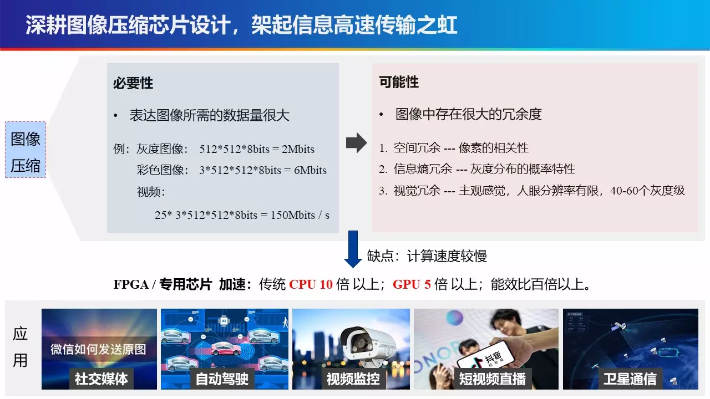
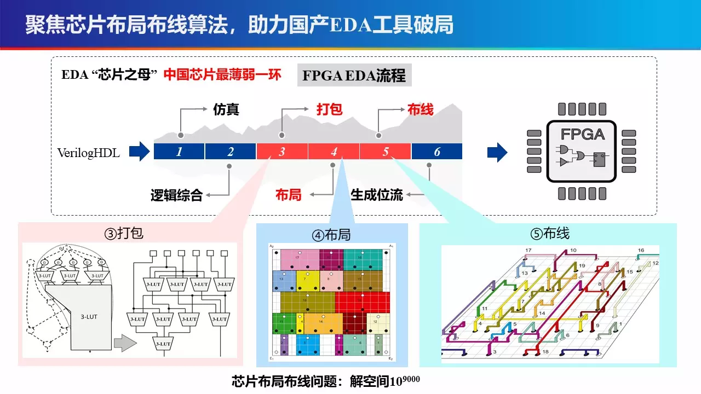

1.研究方向：基于AI的图像编解码芯片设计
---
  
    
- 作为主要研发人员，深度参与完成了我国首颗宇航级高速图像压缩芯片“雅芯-天图”，芯片采用0.18μm宇航抗辐照工艺，于2018年成功应用于高分十一号卫星遥感卫星、“嫦娥系列”探月卫星、“天舟一号”货运飞船等。
- 研究高性能图像压缩编解码算法与硬件加速器， 重点包括JPEG、JPEG2000、Lepton、Guetzli等。参与复旦大学ASIC重点实验室范益波教授主持的项目“基于硬件的JPEG无损编码及转码系统项目”荣获阿里巴巴创新研究计划优秀学术项目奖！ [项目合作方：复旦大学ASIC国家重点实验室、阿里巴巴]  
- 研究成果发表在IEEE TCAS-Ⅱ(JCR Q2) 、IEEE TCSVT(JCR Q1) 等期刊。  
- 10Gbps网络处理器芯片[项目合作方：西安电子科技大学宽带隙半导体国家重点学科实验室]   

2.研究方向：超大规模芯片物理实现算法
---
   
   

- 聚焦布局布线、时序分析、AI4EDA等，在IEEE TCAD’22 (领域TOP期刊、唯一CCF-A 期刊)、IEEE/ACM DAC’22(CCF-A，领域TOP会议)、IEEE TCAS-Ⅱ’22(JCR Q2) 等发表多篇学术论文。  
- 荣获国内多个EDA算法竞赛的全国一等奖。  
- 凝练学术成果，助力中国“芯”：安路科技(民用国产FPGA领军企业)、航天九院、华为2012诺亚实验室(全球顶尖芯片设计研发机构)开展深入合作。 
 

3.代表性论文
---
- Jing Mai, Yibai Meng, **Zhixiong Di**, Yibo Lin, "Multi-Electrostatic FPGA Placement Considering SLICEL-SLICEM Heterogeneity and Clock Feasibility," in DAC 2022(accept).(CCF-A)
- **Z. Di**, X. Chen, Q. Wu, J. Shi, Q. Feng and Y. Fan, "Learned Compression Framework With Pyramidal Features and Quality Enhancement for SAR Images," in IEEE Geoscience and Remote Sensing Letters, vol. 19, pp. 1-5, 2022, Art no. 4505605, doi: 10.1109/LGRS.2022.3155651.(JCR Q2)
- J. Chen, **Z. Di**, J. Shi, Q. Feng and Q. Wu, "NBLG: A Robust Legalizer for Mixed-Cell-Height Modern Design," in IEEE Transactions on Computer-Aided Design of Integrated Circuits and Systems, doi: 10.1109/TCAD.2021.3137007.(CCF-A)
- Q. Xu, Y. Xiang, **Z. Di** et al., "Synthetic Aperture Radar Image Compression Based on a Variational Autoencoder," in IEEE Geoscience and Remote Sensing Letters, vol. 19, pp. 1-5, 2022, Art no. 4015905, doi: 10.1109/LGRS.2021.3097154.(JCR Q2)
- Z. Shao,**Z. Di**, et al., "A High-Throughput VLSI Architecture Design of Canonical Huffman Encoder," in IEEE Transactions on Circuits and Systems II: Express Briefs, vol. 69, no. 1, pp. 209-213, Jan. 2022, doi: 10.1109/TCSII.2021.3091611.(JCR Q2)
- X. Chen, **Z. Di**, W. Wu, Q. Wu, J. Shi and Q. Feng, "Detailed Routing Short Violation Prediction Using Graph-Based Deep Learning Model," in IEEE Transactions on Circuits and Systems II: Express Briefs, vol. 69, no. 2, pp. 564-568, Feb. 2022, doi: 10.1109/TCSII.2021.3093420.(JCR Q2)
- Q. Wu, X. Li, Y. Han, **Z. Di** and Q. Feng, "A Valley-Locking Control Scheme for an Audible Noise-Free Valley-Skip-Mode Flyback Converter," in IEEE Transactions on Industrial Electronics, vol. 69, no. 7, pp. 7285-7294, July 2022, doi: 10.1109/TIE.2021.3099223.(JCR Q1)
- X. Yan, **Z. Di**,  et al., "A High Throughput and Energy Efficient Lepton Hardware Encoder with Hash-based Memory Optimization," in IEEE Transactions on Circuits and Systems for Video Technology, doi: 10.1109/TCSVT.2021.3129895.(JCR Q1)
- Q. Wu, X. Li, Y. Li, **Z. Di** and Q. Feng, "Implementation of High Precision Error Amplification Scheme for AC-DC Converter," in IEEE Transactions on Circuits and Systems II: Express Briefs, vol. 69, no. 3, pp. 1522-1526, March 2022, doi: 10.1109/TCSII.2021.3126166.(JCR Q2)
- **Zhixiong Di**, Yongming Tang, Jiahua Lu, Zhaoyang Lv:ASIC Design Principle Course with Combination of Online-MOOC and Offline-Inexpensive FPGA Board. ACM Great Lakes Symposium on VLSI 2021: 431-436. (教学研究论文)(CCF-C)

