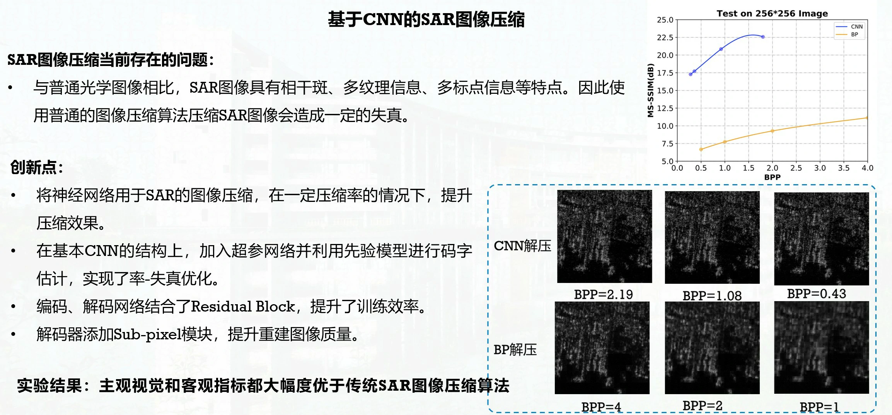
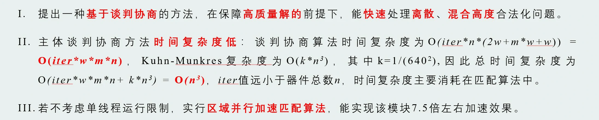
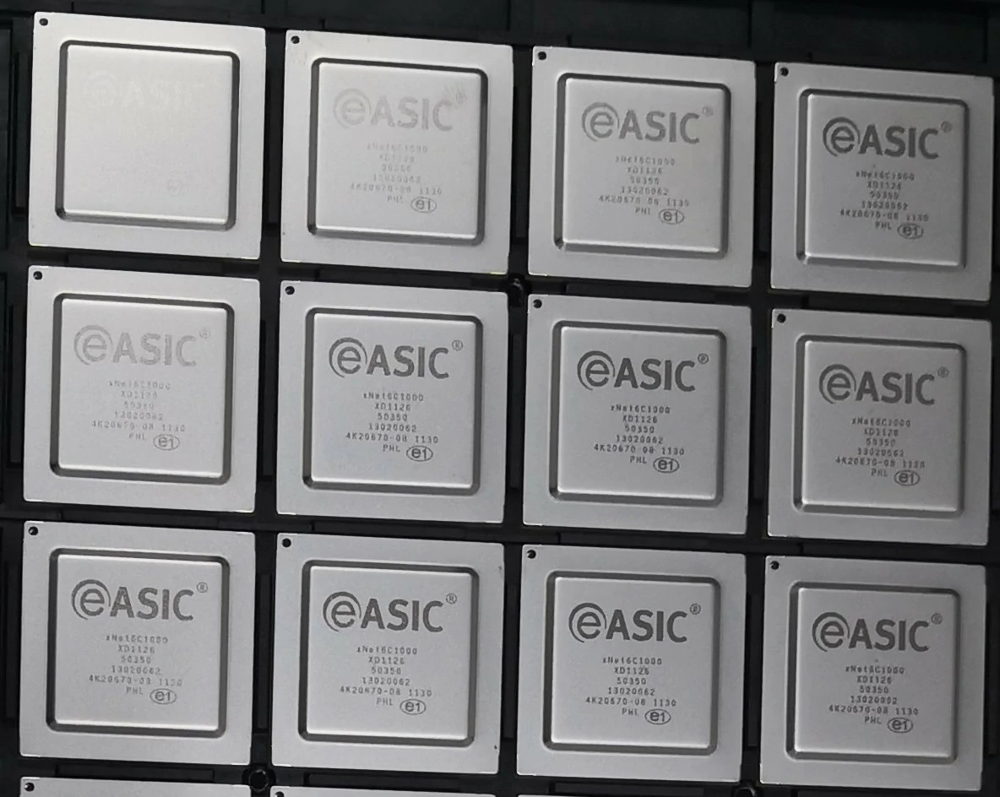
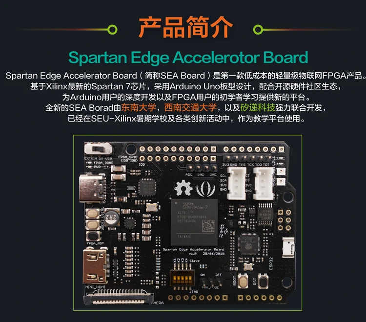

科研项目：主持国家自然科学基金（青年基金）、四川省科技厅面上项目等纵向项目2项，主持多项企业横向项目；参与国家自然科学重大项目、重点项目等多项。

1.科研概况：图像压缩芯片
---
- 作为主要研发人员，深度参与完成了我国首颗宇航级高速图像压缩芯片“雅芯-天图”，芯片采用0.18μm宇航抗辐照工艺，于2018年成功应用于我国目前最高分辨率的高分十一号卫星遥感卫星、“嫦娥系列”探月卫星、“天舟一号”货运飞船等。
- 研究高性能图像压缩编解码算法与硬件加速器， 重点包括JPEG、JPEG2000、Lepton、Guetzli等。与复旦大学ASIC国家重点实验室、阿里巴巴合作提出了优化Huffman、基于主观视觉质量的压缩编码、基于AI的压缩编码算法及其硬件加速器。参与复旦大学ASIC重点实验室范益波教授主持的项目“基于硬件的JPEG无损编码及转码系统项目”荣获阿里巴巴创新研究计划优秀学术项目奖！ [项目合作方：复旦大学ASIC国家重点实验室、阿里巴巴]
- 基于神经网络的SAR图像压缩

2.科研概况：基于AI的数字芯片与FPGA物理实现算法
---
研究方向：数字集成电路、FPGA布局布线相关算法；FPGA部分可重构设计；
[项目合作方：西安电子科技大学宽带隙半导体国家重点学科实验室]
- 布局合法化算法：提出了一种基于谈判协商的FPGA布局合法化算法，获得第二届EDA精英挑战赛“FPGA CAD”赛道第一名。

- 布线算法：算法性能优于知名布线器  

- 拥塞预测算法：将AI算法应用于可布线性预测中，预测性能与泛化能力均优于现有算法。
- FPGA部分可重构设计

3.科研概况：其他
---
- 10Gbps网络处理器芯片[项目合作方：西安电子科技大学宽带隙半导体国家重点学科实验室]

- 开源FPGA及实时可重构计算方法研究[项目合作方：东南大学、Xilinx、Seeed Studio]  
已在“全国大学生FPGA创新设计竞赛”、Xilinx FPGA暑期学校中应用；  
已应用于美国、荷兰、德国、越南等青少年编程、FPGA教育中；

